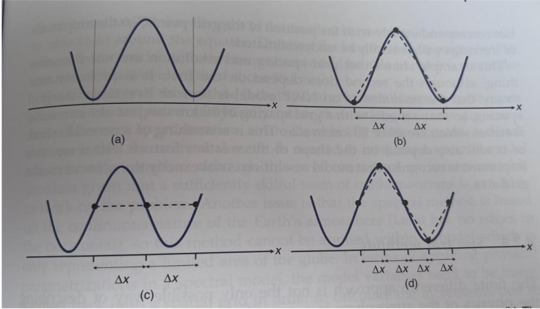
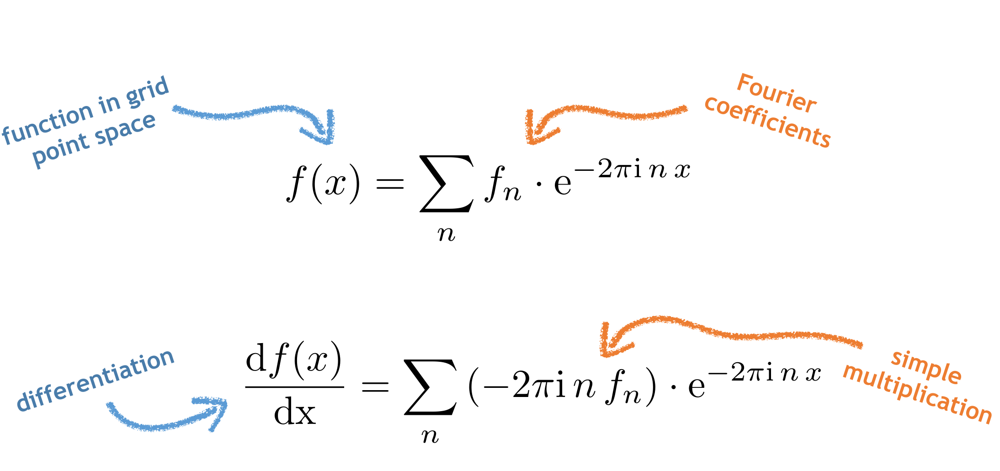
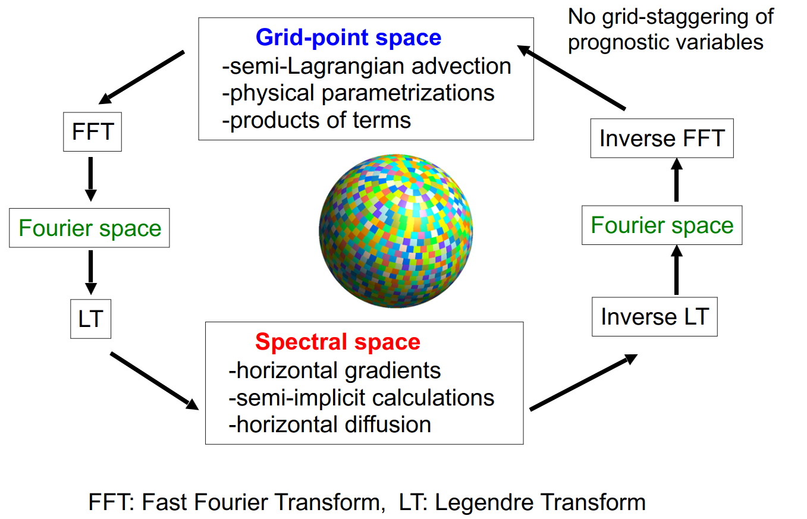
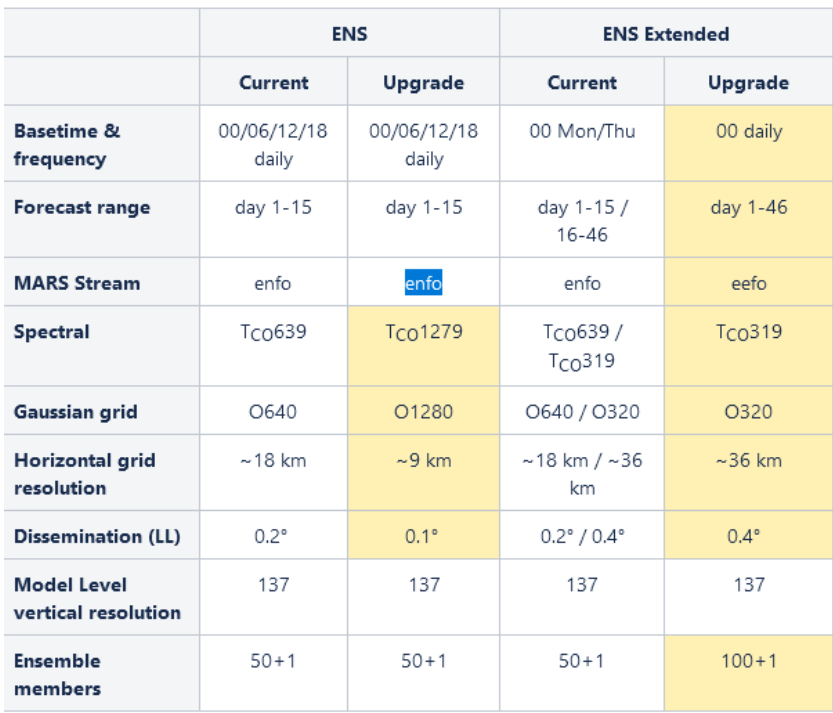
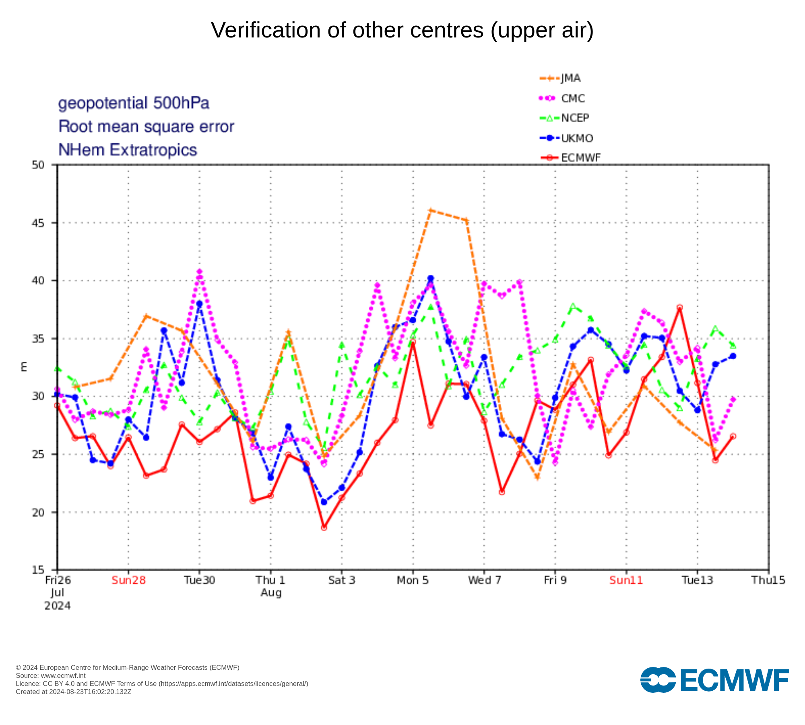
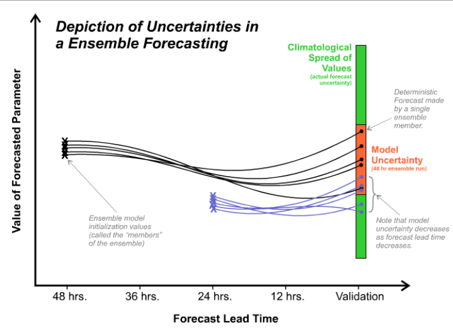
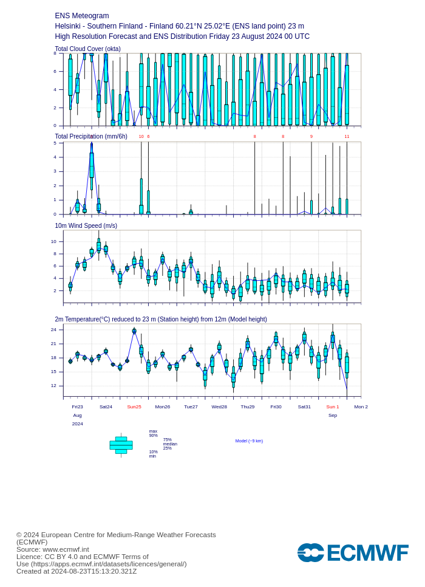
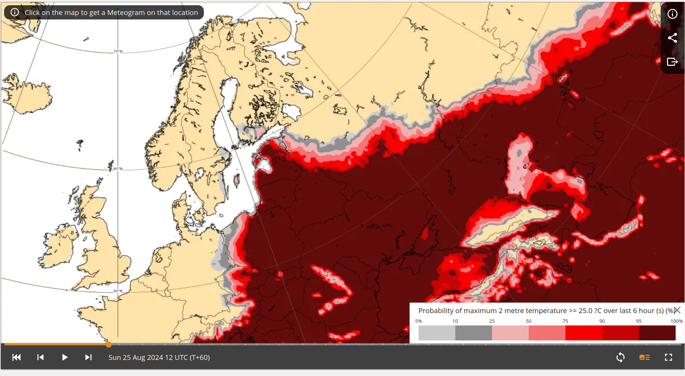
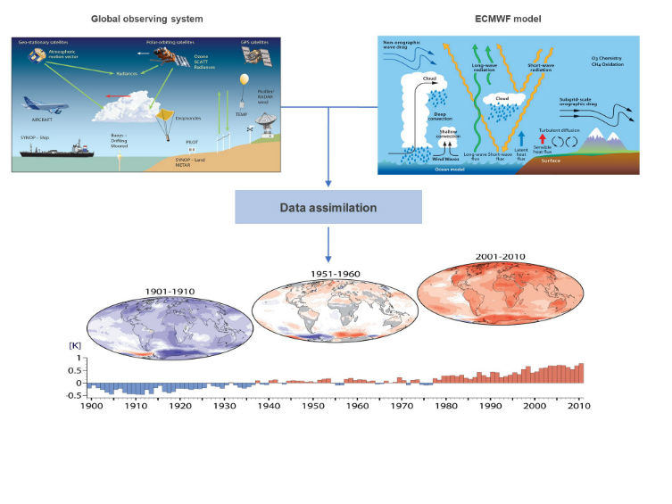

# Topics 
## Part 1: History of Numerical Weather Prediction (NWP)
## Part 2: Classical numerical modelling concepts
## Part 3: State of NWP today & Reanalysis
## Part 4: What are Earth System Models (ESMs)
## Part 5: Remaining Challenges

	
	
# Some terminology
- Numerical Weather Prediction (NWP) Models
  - Traditionally an atmosphere only model, now some include ocean models
- General Circulation Model (GCM)
	- A type of climate model
	- Includes physical aspects of the Earth - the atmosphere, ocean and sea ice.
- Earth System model (ESM)
	- Includes all aspects of the Earth system -  physical, chemical and biological processes
    

# Part 1: History of Numerical Weather Prediction (NWP)

# History of Numerical Weather Prediction (1)
<div class="column">
- Abbe (1901) proposed that the laws of physics could be used to forecast the weather;  that it was an initial value problem. 
- He identified that the thermodynamic and hydrodynamic equations could be used.
- Did not know how to solve the equations
</div>
<div class=column>
{.center width=800}
<div style="text-align:center"><span style="font-size:0.4em"> Left: Cleveland Abbe (1838–1916). <br> Centre: Vilhelm Bjerknes (1862–1951). <br> Right: Lewis Fry Richardson (1881–1953) <br> <br> (from "The origins of computer weather prediction and climate modelling" by Peter Lynch) <br> <https://doi.org/10.1016/j.jcp.2007.02.034/></div>


# History of Numerical Weather Prediction (2)
- Bjerkness (1904) proposed a two-step plan for rational forecasting
	- <small> A ***diagnostic step***, where the initial state of the atmosphere is determined using observations 
	- A ***prognostic step***, where the laws of motion are used to calculate how this state changes over time.
  </small>
- Bjerknes listed 7 variables:
	- <small>pressure, temperature, density, humidity and the 3 components of velocity (u,v,w) </small>
- Bjerknes identified 7 independent equations: 
	- <small>the three momentum equations, the continuity equation, the equation of state and the equations expressing the first and second laws of thermodynamics
	- he should have specified a conservation equation for water (q) rather than the second thermodynamic law. </small>

# History of Numerical Weather Prediction (3)

- Richardson (1922) developed the first NWP system.
- Simplified Bjerkness’s set of equations
- Divided the atmosphere into grid cells
- Finite difference solutions of differential equations 

# Richardson's Forecast
- Richardson performed a 8 hour forecast for two points in Europe – solving the equations by hand.
- Took 6 weeks (so not a very useful forecast)
- The forecast was also a disaster – predicted a pressure change of 145 hPa in 8 hours whereas in reality the pressure did not change much. 
- Richardson identified the cause of the failure as the accuracy and smoothness of the initial conditions. 
- Despite the failure of this first forecast his pioneering method was eventually proved correct.

# Richardson's Forecast factory - a dream
<div class="column" style="width:65%">
-  <small> Would require 64,000 mathematicians each with a mechanical calculator </small>
-  <small>Every person would perform a part of the calculation.  </small>
-  <small>A leader in the centre, using coloured signal lights and telegraph communication, would coordinate the forecast. </small>
-  <small>Richardson “Perhaps some day in the dim future it will be possible to advance the computations faster than the weather advances …. But that is a dream.” </small>
</div>
<div class="column" style="width:30%">
{.center width=600}

<div style=font-size:0.4em>  
Richardson's forecast factory - an Illustration by F. Schuiten
</div>

# Challenges for the first weather forecasts
- These ideas were formulated long before the first electronic computers were made
- Many practical obstacles needed to be overcome before these ideas could be put into practice
	- How to accurately specify the initial state
	- How to solve the complex set of equations
	- Progress required a computer


# First electronic, programmable computer

When was this built? 

Does anyone know its name? 

# ENIAC (Electronic Numerical Integrator And Computer)
<div class="column" style="width:65%">
- World's first programmable computer
- Built between 1943 - 1946 for the US Military
- Was 2.5 m tall and 25 m long, weighed 30 tonnes
- Later used by von Neumann and Charney to perform the first weather forecasts
    - technically these were hindcasts (not run in real time)
</div>

<div class="column" style="width:30%">>
{.center}

<div style=font-size:0.4em>  
ENIAC <br> https://en.wikipedia.org/wiki/ENIAC
<br>
<br>
*von Neumann* contributed to many aspects of mathematics and physics, worked on the
Manhatten project, many of his ideas are still fundamental in NWP e.g. numerical stability
analysis
<br>
<br>
Charney is one of the founders of dynamical meteorology having developed many theories
we still use today
</div>

# First real time forecasts
When was the first real time weather forecast produced? 

What country was it run in?


# First real time forecasts
<div class="column" style="width:65%">
- Took place in Stockholm in 1954
- Based on a 2-dimensional (single level) barotropic model
- Grid spacing was 300-km
- Model domain was 9000 x 12,000 km
- 24, 48 and 72 hour forecasts
- Most successful forecast had a correlation coefficient of 0.87

</div>
<div class="column" style="width:30%">>
{.center}
 <div style=font-size:0.4em> Bolin, B. Numerical forecasting with the barotropic model. Tellus 7, 27–49 (1955), <https://doi.org/10.1111/j.2153-3490.1955.tb01139.x> </div>
 
# Part 2:  Classical numerical modelling concepts
 
# Important concepts in modern NWP - now covered
 - Equations and Approximations
 - Dynamical core and physical parameterizations
 - Coordinate systems
 - Spectral versus grid point models
 - Dynamical core and physical parameterizations
 - Time steps and numerical stability
 - Model execution / process each time step
 
# Basic Ingrediants of a NWP model
- Need to write down the laws of physics which determine how the atmospheric state will evolve in time – similar to what Bjerkness and Richardson did > 100 years ago
- Most of the governing equations concern conservation of key quantities:
  - Momentum
  - Energy
  - Mass
  - Water
  
# Governing Equations
- Newton’s 2nd law – conservation of momentum (winds)
- Continuity equation - conservation of mass
- 1st Law of thermodynamics – conservation of energy (temperature)
- Equation of state for a perfect gas (relates pressure, temperature and density)
- Conservation of water vapour

# The equations (in a simple-ish form)


# The equations
- Complex in reality - use longitude and latitude as coordinates
- Here the vertical cooridinate is $\eta$ (more about this later)
- These are from the IFS documentation


# Approximations to the full Equations - Why?
- To save computing time or simplify the solutions of the equations
- To supress / filter out undesirable non-meteorological solutions e.g. fast moving sound waves

# Approximations (1)
- Shallow “atmosphere” approximation
  - Replace $r$ (distance from centre of the Earth) with $a$ (the radius of the Earth)
- Hydrostatic approximation
  - Assumes balance between gravity and vertical pressure gradient so $\frac{\partial w}{\partial t} = 0$
  - Valid at scales > 5-10 km
  - Eliminates vertically propagating sound waves (huge help with stability)
  - Models that make the hydrostatic approximation but no other approximation are called primitive equation models

# Approximations (2)
- Anelastic approximation
  - Neglects time derivative of density in continuity equation
   - So three dimensional divergence of air = 0
   - filters out horizontally propagating sound waves
- Quasi Geostrophic Equations
  - winds are replaced with geostrophic winds
  - Also include the hydrostatic approximation
  - Filters out sound and gravity waves and inertial oscillations
  - Very extreme – never used for forecasting now but was the equations used in the ENIAC forecasts
  
# "Dynamics" + "Physics"
- If the atmosphere was a closed system the dynamical (conservation) equations would be enough
- BUT….The atmosphere interacts with the surface and energy is exchanged at the top of the atmosphere
- This leads sources and sinks that need to be modelled / parameterised
- Processes also occur in the atmosphere that are too small to be resolved
- Need to be parameterized
- Often referred to as “the Physics”

# Parameterization
- Processes are not explicitly resolved, rather their impact on various model parameters is.
- Often rather pragmatic....
- Some complex processes are well understood but too computationally expensive to resolve explicitly
- Other processes are not well understood but are known to have a large impact – often empirically modelled and not based on physics

# Processes that are parameterized
<div class="column" style="width:30%">
- Radiative transfer
- Surface and boundary layer processes
- Convection (if $\Delta x$> 2-4 km
- Clouds and large scale precipitation
- Gravity wave drag
- (Chemistry) 
</div>
<div class="column" style="width:65%">

</div>

# "Dynamics" and "Physics" - recap
- "Dynamics" is the dynamical core of the model
  - the equations of motion, continuity equation etc.
  - large scale resolved processes
  - advection, pressure gradients, Coriolis force
  
- "Physics" 
  - same scale processes, the efffects of which on the dynamics is parameterized


# Building the dynamics and physics into a model
- Need to use physical principles as accurately as possible while still producing the forecasts in time
- Many difficult to choices / compromises need to be made
- Often relates to the mathematical methods used to integrate the equations forward in time
	- This would be a whole course so only very basics covered here!
 
# Finite Difference methods
- The equations have no analytical solution
- Need to replace continuous derivatives in time and space with finite differences
- Need to specify a finite timestep dt compute how the variables will change over that time interval
- Replace $\frac{\partial u}{\partial t}0$  with $\frac{\Delta w}{\Delta t}$
- Need to make sure $\Delta t$ is not “too long” – come back to this
- Also replace $\frac{\partial p}{\partial x}0$  with $\frac{\Delta p}{\Delta x}$ etc.. 

# Finite Differences
<div class="column" style="width:30%">
- Try to estimate $\frac{\Delta p}{\Delta x}$ at point B
- Use the pressure values at points A and C
- centered difference 
</div>
<div class="column" style="width:65%">

<div style=font-size:0.4em>  
image from "Operational Weather Forecasting by Innes & Dorling"</div>
</div>

# Centered difference
<div class="column" style="width:30%">
- Same example as the last slide
- Underestimate the pressure gradient at point B
- errors are introduced by the discretization.
</div>
<div class="column" style="width:65%">
 
<div style=font-size:0.4em>  
image from "Operational Weather Forecasting by Innes & Dorling" </div>
</div>

# Staggered grids - one solution
<div class="column" style="width:50%">
- An NWP grid box in which the wind variables (u,v) are held at the centre of the box and pressure and potential temperature are held at the edges of the box
- Now only have $\Delta x$ not 2 $\Delta x$
- Can be a pain when post-processing output!
</div>
<div class="column" style="width:45%">

<div style=font-size:0.4em>  
image from "Operational Weather Forecasting by Innes & Dorling" </div>
</div>


# Coordinate systems
<div class="column" style="width:65%">
- The atmosphere needs to be divided into grid cells in the east-west, north-south and vertical direction. 
- Different types of grids in the horizontal and vertical exist - all have different numerical advantages and disadvantages
- More grid cell-> smaller grid spacing (better resolution) but more computationally expensive
</div>

<div class="column" style="width:30%">

</div>

# Coordinate systems - horizontal
<div class="column" style="width:65%">
- Specified in terms of longitude and latitude (rather than x and y)
- Gaussian grids
- Reduced Gaussian grids
	- the number of gridpoints around each latitude circle decreases towards the poles
- Recently new grid types: Icosahedral and Octahedral grids
	- ICON (Icosahedral Nonhydrostatic) Model
	- IFS uses an octahedral reduced Gaussian grid 
</div>

<div class="column" style="width:30%">

</div>


# Coordinate systems - vertical (1)
<div class="column">
- Geometric height (rarely / never used)
- terrain following / sigma coordinates ($\sigma = p / p_s$)
- hybrid coordinate - terrain following near the surface, pressure coordinate aloft. (commonly used)
	- Sometimes called a $\eta$ coordinate

</div>

<div class="column">

</div>

# Coordinate systems - vertical (2)
<div class="column">
- Often models include post-processing aspects and can output variables on constant pressure levels
- More user friendly as with changing surface pressure the height of $\sigma$ and $\eta$ levels changes in time 
</div>

<div class="column">

</div>


# Numerical Stability
- We need to specify a timestep, $\Delta t$, when running an NWP model
- Longer time steps -> fewer time steps -> the model runs faster
- However, if the time step is too long, the model becomes numerically unstable

# Numerical Stability
- Consider what would happen if we reduced the grid size by a factor of 5 (e.g. from 50 to 10 km) without changing the time step
- In the original coarse grid, an air parcel might move from one grid box to the next in the timestep (dt) e.g. move 50 km
- In the “new” high rsolution 10 km grid, the air parcel will have still moved 50 km but this is now 5 grid boxes
- Now the finite difference approach to compute the gradient is inappropriate – it is the gradient across the whole path that is appropriate

# The Courant, Friedrichs and Lewy (CFL) condition
- In the 1920s, Courant, Friedrichs and Lewy studied the numerical solutions of partial differential equations
- Key result was there is a limitation on the time-step for a given space step / dx

$$C=\frac{u \Delta t}{\Delta x} \leq C_{max}.$$

where $C$ is the Courant Number, $u$ is the wind speed / velocity, $\Delta t$ is the time step (s) and $\Delta x$ is the grid spacing. 

- $C_{max}$ depends on the method (implicit or explicit) used to solve the discretized equations
- The CFL criteria limits the length of the time step that can be used for the integration to remain numerically stable. 
- CFL violations are a common cause for NWP models to crash

# Grid box size and "resolution"
- Often these terms are used inter-changeably but they do not mean the same thing!
- Grid box size = how large in km or degrees the grid cells are
- Resolution = what scale of atmospheric features you can resolve correctly with the given grid box size

# Grid box size and "resolution"

 
<div class="column" style="width:60%">
- a wave type feature in the x direction (a)
- three grid points get the variation but it is a saw-tooth (b)
- The wave is shifted ¼ of a wavelength but now the 3 grid points miss the wave completely (c)
- Now have 5 grid points and the wave will be resolved regardless of wave (d)

</div>
<div class="column" style="width:35%">

<div style=font-size:0.4em>  
Typically models can only resolve features on spatial scales that are 5 – 7 times the size of the grid spacing </div>
</div>

# Break

# Spectral models - an alternative to finite differences
- An alternative way to compute spatial and time derivatives
- Both methods (grid point / finite difference models and spectral models) have advantages and disadvantages
- Numerical methods used to solve the equations differs between grid point and spectral models

- Give a quick overview to the spectral method 
  - more in-depth detail can be found in the references listed at the of the slides
  - some material from Andreas Muller, ECMWF
  

# Spectral methods
- Key idea is to decompose the meteorological fields into a series of spectral harmonics in two dimensions
- Similar to how a Fourier series decomposes a 1-D data set (e.g. timeseries) into a series of sines and cosines
- Represent the spatial variations of variables as a finite series of waves of differing wavelengths.
- Best suited to global models as these are periodic: $u(x) = u(x+2π)$

<!--# Fourier series
 $$\Phi = e^{i(kx + ly)} $$
 $$\frac{\partial \Phi}{\partial x} =  ik \Phi   $$


- Differentiation now becomes multiplication
- Spatial derivatives can be computed analytically and very fast
-->

# Spectral methods 


# Spectral methods 

 Differentiation now becomes multiplication

# Spectral models - resolution
- Resolution is a function of the number of waves used in the model
- Model resolution is limited by the maximum number of waves
- Often discussed in terms of truncation (truncated series)
  - very short waves are not represented
  
# Spectral models - resolution
- Example: Fourier series truncation 10 means there are 10 sine terms, 10 cosine terms, plus a mean term
- IFS uses triangular truncation of spherical harmonics, e.g. T159, T255, T511, or T1279 number of terms (“T” for triangular)


# Challenges with spectral models
- Dealing with the output
- The Earth is not flat and also has 2 spatial dimensions - not so simple as a Fourier transform
- The "Physics" and non-linear terms still need to be computed in grid point space
  
   
# Challenge #1: Model output
- The state variables are stored as amplitudes of the spherical harmonics
- Explains the complicated model output 
 - Some variables saved in grid point space, other as spectral coefficients
 - Can have two files for each output timestep


# Challenge #2: Spectral decomposition on a sphere


# Challenge #2: Spectral decomposition on a sphere
- W-E (periodic): sine and cosine (zonal wavenumbers, m)
- S-N (non-periodic): Legendre polynomials
- m = zonal wavenumbers, n=total wavenumbers

# Challenges #3: transform between spectral and grid point space
- The "Physics" and non linear terms still need to be computed in grid point space
   - need to constantly transform between spectral and grid point space
- For high resolution, this becomes computationally expensive
  - 9 km grid spacing = 24% of run time for spectral transform
  - 5 km grid spacing = 31%
  - 1.25 km grid spacing = 41%
   
# Timestep in a spectral model   

   


# Spectral transform method

Short practical:
<https://anmrde.github.io/spectral/>


# Part 3: State of NWP today & Reanalysis

# State of NWP today
<div class="column">
<div style=font-size:0.8em>
- Many different global and limited area NWP models have been developed and are run operationally
- Forecast accuracy has increased at a rate of about 1 day per decade
- A 5-day weather forecast today is as accurate as a 4-day forecast was 10 years ago
- Weather Forecasts are now very accurate and save many lives and huge amounts of money each year
- (communicating them to the public and stakeholders is still a huge challange)
 </div>
  </div>
<div class="column">


<div style=font-size:0.4em> Bauer, P., Thorpe, A. & Brunet, G. The quiet revolution of numerical weather prediction. Nature 525, 47–55 (2015). <https://doi.org/10.1038/nature14956> </small>
 </div>
 </div>
 
# The Integrated Forecast System (IFS)
<div class="column" style="width:50%">
<div style=font-size:0.8em>
 - Developed by the European Centre for Medium Range Weather Forecasting (ECMWF)
 - "System" includes the forecast (NWP) model **and**  observation processing **and** data assimilation scheme
 - Now coupled to a dynamical ocean model, NEMO.
 - Written in Fortran
 - OpenIFS is a version of the IFS that is available to universities and research institutes. 
	 - now includes basic aerosol and chemistry
 </div>
  </div>
<div class="column" style="width:45%">

 </div>	 
 
 
# ICON (Icosahedral Nonhydrostatic) Model
<div class="column" style="width:75%"> 
<div style=font-size:0.8em>
-  ICON (ICOsahedral Nonhydrostatic) is a modeling framework for weather and climate
-  Solves the full three-dimensional non-hydrostatic and compressible Navier-Stokes equations on an icosahedral grid 
-  Allows for predictions from local to global scales
-  Jointly developed by the German Weather Service (DWD), the Max Planck Institute for Meteorology (MPI-M), the German Climate Computing Center (DKRZ) and the Karlsruhe Institute for Technology 
-  <https://www.icon-model.org/>
- Lots more about ICON later this week!
</div>
</div>

<div class="column" style=width:20%>

</div>

# RMSE for 6 different global NWP models
<div class="column">

</div>

<div class="column">
- 5-day forecasts of the 500-hPa geopotential height over the past 5 weeks from 5 different global models
- RMSE averaged over the northern hemisphere extra-tropics
- Some periods are easier to predict than others
- Some weather patterns are easier to predict.
</div>


# Ensemble Forecasting (1)
<div class="column" style="width:60%">
- The atmospheric is inherently chaotic
- Small errors will grow and become larger as forecast length increases
- All forecasts / NWP models have two types of errors:
- initial state errors as we do not know the initial state of the atmosphere perfectly
- model formulation errors - we cannot resolve all processes perfectly
</div>
<div class="column" style="width:35%">

<div style=font-size:0.4em>  
https://www.e-education.psu.edu/meteo810/content/l4_p6.html </div>
</div>

# Ensemble Forecasting (2)
- Ensemble forecasting aims to obtain estimates of predictability and forecast skill
- Ensemble forecasts involve producing a set of different forecasts given an initial weather situation.
- Two approaches to create the different forecasts:
- Perturb the initial conditions to account for initial condition uncertainty
- Apply small stochastic perturbations to the model physics to account for uncertainties in the model formulation.

# Ensemble Forecasting (3)
- Used operationally by most national weather forecast agencies for weather, sub seasonal and seasonal forecasting
- Also used in the climate modelling community
- Less common in climate modelling due to the large computational expense but can be very useful
	- Multi-model ensembles are more commonly used
	
	
# Example Ensemble Weather Forecast
<div class="column" style="width:40%">
{.center}
</div>

<div class="column" style="width:50%">
<div style=font-size:0.8em>
- "Meteogram" from ECMWF for Helsinki
- Forecast from last Friday, covers the time period until Monday 2nd
- boxes show the spread in the ensemble (10 - 90th percentiles)
- lines show the max and min values
- from www.ecmwf.int </div>
</div>

# Example Ensemble Weather Forecast
<div class="column" style="width:40%">
{.center}
</div>

<div class="column" style="width:50%">
- "Plumes diagram" for same location / dates as last slide
- Spread (uncertainity) increases with forecast length
- from www.ecmwf.int
</div>

# Example Ensemble Weather Forecast
{.center width=65%}
Can compute probabilities of certain weather events, e.g. temperature exceeding 25C  (from www.ecmwf.int)


# Reanalysis data
<div class="column" style="width:60%">
- Combination of model and observations
  - Data assimilation
- Can be considered our best guess of the state of the atmosphere but not complete “truth”
- Gridded datasets – 4 dimensional (x,y,z,t)
- Contains hundreds of variables
	- temperature, winds, cloud properties, rain, snow, soil temperature etc
</div>
<div class="column" style="width:35%">

<div style=font-size:0.4em>https://www.ecmwf.int/en/about/media-centre/science-blog/2017/era5-
new-reanalysis-weather-and-climate-data   </div>
</div>

# ERA5 Reanalysis
- One of the most commonly used reanalysis
- Developed by the European Centre for Medium Range Forecasts (ECWMF)
- Available at 1 hourly temporal resolution from the 1st January 1940 – present
- 0.25 degree horizontal grid spacing
- 137 model levels, data also on 37 pressure levels
- Huge data set ~5 petabytes
- Openly available: https://cds.climate.copernicus.eu
- Ideal training dataset for ML models


# Part 4: What are Earth System Models (ESMs)

# Earth System Models
- How do these differ from a numerical weather prediction model?

# Earth System Models
- Includes all aspects of the Earth system - physical, chemical and biological processes – not just the atmosphere
- Includes the global carbon cycle, dynamic vegetation, atmospheric chemistry, ocean bio-geo-chemistry and ice sheets
- Many different sub-models that are coupled together - massive amount of code!
- These models participate in CMIP (Coupled Model Intercomparison Project)
- Atmospheric part is the same dynamics + physics (and sometimes even the same code) as NWP models


# Earth System Models - feedbacks
- Allow for complex feedbacks to be modelled
- Two examples:
	- increasing CO_2 emissions -> increased temperatures -> sea ice loss -> increased albedo -> increased temperatures
	- increased temperatures -> more biogenic emissions from vegetation -> potentially more aerosol -> more CCN -> diffreent cloud properties
	
- many more feedbacks exist!


# EC-Earth
<div class="column">
- EC-Earth is one ESM, developed by a consortium in Europe (grey shaded countries)
- <https://gmd.copernicus.org/articles/15/2973/2022/>
</div>

<div class="column">

</div>

# EC-Earth 
<div class="column" style="width:60%">
- Contains many different models of different parts of the Earth System
- These need to be coupled together – can be a computational bottleneck
</div>

<div class="column" style="width:35%">

</div>

# EC-Earth 
<div class="column" style="width:60%">
- Many variables need to be passed back and forward between the different components of an ESM.
- Red arrows with numbers indicate the time frequency that variables are passed
  - range from 45 minutes to 1 year depending on the processes
- Traditionally chemistry was a separate model, now moving to combine it with the atmospheric model
</div>
<div class="column" style="width:35%">

</div>

# EC-Earth 
<div class="column">
Variables that are passed from the atmosphere model (IFS) to the Chemistry Transport model (TM5) in EC-Earth3 and vice-versa.
</div>
<div class="column">

</div>

# Part 5: Remaining challenges

# Remaining challenges
- What do you think the biggest challenges are in:
	- Numerical Weather Prediction?
   -  Earth System modelling? 
 
- Discuss with the people next to you

# Remaining challenges
- Many extreme events occur on small scales are our models do not resolve them well
- To have higher resolution models, requires more computing power - or more computationally efficient models
- Including more and more processes increases computational cost
- Almost all NWP and ESM models are written in Fortran

# A few words about my own research
 - If you are interested, have similar interests please come and talk to me

#
{width=80%}

#
{width=80%}

 

# Thank you

Any questions?

victoria.sinclair@helsinki.fi

# Useful textbooks
- "Atmospheric modeling, data assimilation and predictability" by Eugenia Kalnay (2003; Cambridge University Press).
- "Numerical weather and climate prediction" by Thomas Tomkins Warner (2011; Cambridge University Press).
- "Operational weather forecasting" by Peter Innes and Steve Dorling (2013; Wiley-Blackwell).
- "Basic Numerical Methods in Meteorology and Oceanography" by Kristofer Döös, Peter Lundberg, Aitor Aldama Campino  https://doi.org/10.16993/bbs 
<!--CHARNEY, J.G., FJÖRTOFT, R. and Von NEUMANN, J. (1950), Numerical Integration of the Barotropic Vorticity Equation. Tellus, 2: 237-254. https://doi.org/10.1111/j.2153-3490.1950.tb00336.x

# Quick cut-n-paste snippets for easy reference

Two columns:

<div class="column">
- Hello
</div>
<div class="column">

</div>

<!--Image: 

Code block:

```
```

New section:

# New section {.section}

-->
