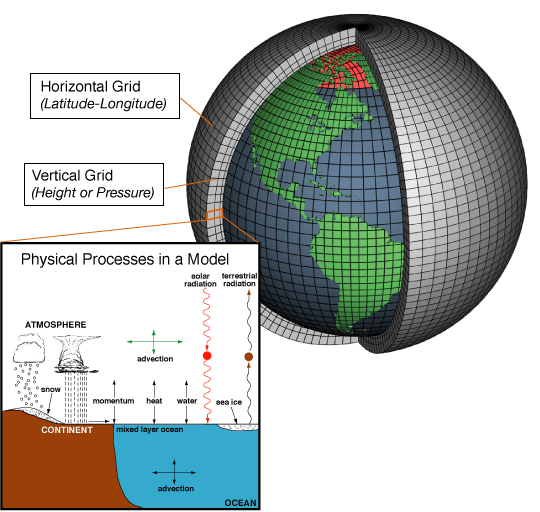

# Topics 
## History of Numerical Weather Prediction (NWP)
## Classical numerical modelling concepts
## What are Earth System Models (ESMs)
## Remaining Challenges

	
	
# Some terminology
- Numerical Weather Prediction (NWP) Models
  - Traditionally an atmosphere only model, now some include ocean models
- General Circulation Model (GCM)
	- A type of climate model
	- Includes physical aspects of the Earth - the atmosphere, ocean and sea ice.
- Earth System model (ESM)
	- Includes all aspects of the Earth system -  physical, chemical and biological processes
    

# Part 1: History of Numerical Weather Prediction (NWP)

# History of Numerical Weather Prediction (1)
<div class="column">
- Abbe (1901) proposed that the laws of physics could be used to forecast the weather;  that it was an initial value problem. 
- He identified that the thermodynamic and hydrodynamic equations could be used.
- Did not know how to solve the equations
</div>
<div class="column">
<div style="text-align:center">

<div style=font-size:0.4em> Left: Cleveland Abbe (1838–1916). Centre: Vilhelm Bjerknes (1862–1951). Right: Lewis Fry Richardson (1881–1953) (from "The origins of computer weather prediction and climate modelling" by Peter Lynch) <https://doi.org/10.1016/j.jcp.2007.02.034/> </div>
</div>

# History of Numerical Weather Prediction (2)
- Bjerkness (1904) proposed a two-step plan for rational forecasting
	- <small> A ***diagnostic step***, where the initial state of the atmosphere is determined using observations 
	- A ***prognostic step***, where the laws of motion are used to calculate how this state changes over time.
  </small>
- Bjerknes listed 7 variables:
	- <small>pressure, temperature, density, humidity and the 3 components of velocity (u,v,w) </small>
- Bjerknes identified 7 independent equations: 
	- <small>the three momentum equations, the continuity equation, the equation of state and the equations expressing the first and second laws of thermodynamics
	- he should have specified a conservation equation for water (q) rather than the second thermodynamic law. </small>

# History of Numerical Weather Prediction (3)

- Richardson (1922) developed the first NWP system.
- Simplified Bjerkness’s set of equations
- Divided the atmosphere into grid cells
- Finite difference solutions of differential equations 

# Richardson's Forecast
- Richardson performed a 8 hour forecast for two points in Europe – solving the equations by hand.
- Took 6 weeks (so not a very useful forecast)
- The forecast was also a disaster – predicted a pressure change of 145 hPa in 8 hours whereas in reality the pressure did not change much. 
- Richardson identified the cause of the failure as the accuracy and smoothness of the initial conditions. 
- Despite the failure of this first forecast his pioneering method was eventually proved correct.

# Richardson's Forecast factory - a dream
- Would require 64,000 mathematicians each with a mechanical calculator
- Every person would perform a part of the calculation. 
- A leader in the centre, using coloured signal lights and telegraph communication, would coordinate the forecast.
-  Richardson “Perhaps some day in the dim future it will be possible to advance the computations faster than the weather advances …. But that is a dream.”

# Challenges for the first weather forecasts
- These ideas were formulated long before the first electronic computers were made
- Many practical obstacles needed to be overcome before these ideas could be put into practice
	- How to accurately specify the initial state
	- How to solve the complex set of equations

<!-- # Simplified Equation sets
- Atmospheric motion includes a range of processes covering a wide range of spatial and temporal scales
- The primitive equations also include solutions for high frequency gravity waves - to resolve these requires very small time steps 
- Rossby in the 1930's showed that the large-scale motions in the atmosphere could be represented quite well with the barotropic vorticity equation - geostrophically balanced dynamics / a set of filtered equations 

# Solving equations numerically
- Need to discretize the equations
- 
-->

# First electronic, programmable computer

When was this built? 

Does anyone know its name? 

# ENIAC (Electronic Numerical Integrator And Computer)
- World's first programmable computer
- Built between 1943 - 1946 for the US Military
- Was 2.5 m tall and 25 m long, weighed 30 tonnes
- Later used by von Neumann and Charney to perform the first weather forecasts
    - technically these were hindcasts (not run in real time)

# First real time forecasts
When was the first real time weather forecast produced? 

What country was it run in?


# First real time forecasts
<div class="column">
- Took place in Stockholm in 1954
- Based on a 2-dimensional (single level) barotropic model
- Grid spacing was 300-km
- Model domain was 9000 x 12,000 km
- 24, 48 and 72 hour forecasts
- Most successful forecast had a correlation coefficient of 0.87

</div>
<div class="column">
<div style="text-align:center">
 <div style=font-size:0.4em> Bolin, B. Numerical forecasting with the barotropic model. Tellus 7, 27–49 (1955), <https://doi.org/10.1111/j.2153-3490.1955.tb01139.x> </div>
 
# Part 2:  Classical numerical modelling concepts
 
# Important concepts in modern NWP - now covered
 - Coordinate systems
 - Spectral versus grid point models
 - Dynamical core and physical parameterizations
 - Time steps and numerical stability
 - Model execution / process each time step
 
 
# Coordinate systems
<div class="column">
- The atmosphere needs to be divided into grid cells in the east-west, north-south and vertical direction. 
</div>

<div class="column">

</div>

# Coordinate systems - vertical (1)
<div class="column">
- Geometric height (rarely / never used)
- terrain following / sigma coordinates ($\sigma = p / p_s$)
- hybrid coordinate - terrain following near the surface, pressure coordinate aloft. (commonly used)
	- Sometimes called a $\eta$ coordinate

</div>

<div class="column">

</div>

# Coordinate systems - vertical (2)
<div class="column">
- Often models include post-processing aspects and can output variables on constant pressure levels
- More user friendly as with changing surface pressure the height of $\sigma$ and $\eta$ levels changes in time 
</div>

<div class="column">

</div>

# Coordinate systems - horizontal 
<div class="column">

- Specified in terms of longitude and latitude
- Gaussian grids
- Reduced Gaussian grids
- Recently new grid types
	- Icosahedral and Octahedral grids
</div>

<div class="column">

</div>


# Spectral versus grid point models
- Spectral models represent the spatial variations of variables as a finite series of waves of differing wavelengths.
- Grid point models represent the atmosphere in three-dimensional grid cubes with values of each variables stored in each grid (3D arrays)

- Both methods have advantages and disadvantages
- Numerical methods used to solve the equations differs between grid point and spectral models

# "Dynamics" and "Physics"
- "Dynamics" is the dynamical core of the model
  - the equations of motion, continuity equation etc.
  - large scale resolved processes
  - advection, pressure gradients, Coriolis force
  
- Some processes occur on spatial scales much smaller than the model grid and cannot be explicitly resolved by the model
- Procedures to describe these processes are referred to as "physical parameterizations" or more shortly "the physics"

# Processes that are parameterized 
- cloud microphysics
- turbulence
- surface fluxes
- radiation (long and short wave)
- convection (only in models with dx > ~2.5 km)

  
# Time steps and Numerical stability
- We need to specify a timestep, $\Delta t$, when running an NWP model
- Longer time steps -> fewer time steps -> the model runs faster
- However, if the time step is too long, the model becomes numerically unstable

# The Courant, Friedrichs and Lewy (CFL) condition
- In the 1920s, Courant, Friedrichs and Lewy studied the numerical solutions of partial differential equations
- Key result was there is a limitation on the time-step for a given space step / dx

$$C=\frac{u \Delta t}{\Delta x} \leq C_{max}.$$

where $C$ is the Courant Number, $u$ is the wind speed / velocity, $\Delta t$ is the time step (s) and $\Delta x$ is the grid spacing. 

- $C_{max}$ depends on the method (implicit or explicit) used to solve the discretized equations
- The CFL criteria limits the length of the time step that can be used for the integration to remain numerically stable. 
- CFL violations are a common cause for NWP models to crash


# Model execution - simplified!
- Initialisation: read the initial state files and construct the state vector
- Time evolution: selection of time-stepping method depends on the choice of discretization
- Output: computer program writes the state vector (+ other variables) to the disk storage

- <small> state vector = a vector containing model variables (e.g. u, v, T, q, p) </small>

# Spatial discretization - spectral models
- Global model are also periodic model
	- $u(x) = u(x+2π)$
- Possible to express u(x) with a Fourier series:

$$u(x) = \frac{a_0}{2} + \sum_{m=1}^{\infty} ( a_m cos mx + b_m sin mx) $$ 

- $a_0$ = mean value of u(x) along a latitude circle
- $a_m$, $b_m$ = amplitudes of the wave components

- Reality: a truncated series e.g. T255 includes components m=1,2,...,255.
- Very short waves are not present

# Spectral decomposition in 2D
 - Previously only considered longitude (x) dimension
 - Need to also consider the latitude (y) direction
 - W-E (periodic): sine and cosine
-  S-N (non-periodic): Legendre polynomials

# Spectral decomposition in 2D


# Spatial resolution
 - Grid-point discretization: grid spacing <=> resolution of the model
- Fourier series: number of waves <=> representation of wave combinations of different scales

# Time integration of Fourier series
- All computations in wave space
- compute tendencies of amplitudes


- Not very easy for humans to understand ->  transform output to grid-point space


# Add physical processes
- Previously: all (grid-scale) dynamics in wave space
- Sub grid-scale physical processes are very complicated already in grid-point space
	- How to combine dynamics and physics?
	- Fourier transforms back and forth (fft)
	
# Overall model process
- Compute dynamical tendencies in wave space
- Transform model state to grid-point space
- Compute sub-grid physics tendencies
- Transform physical tendencies back to wave space
- Combine dynamic and physical tendencies in wave space
- Update model state using total tendencies and a time-stepping scheme
	
# Spectral transform method

Short practical 

<https://anmrde.github.io/spectral/>


# State of NWP today
<div class="column">
- Many different global and limited area NWP models have been developed and are run operationally
- Forecast accuracy has increased at a rate of about 1 day per decade
 - a 5 day weather forecast today is as accurate as a 4 day forecast 10 years ago
 </div>
<div class="column">
<div style="text-align:center">

<div style=font-size:0.4em> Bauer, P., Thorpe, A. & Brunet, G. The quiet revolution of numerical weather prediction. Nature 525, 47–55 (2015). <https://doi.org/10.1038/nature14956> </small>
 </div>

# The Integrated Forecast System (IFS)
 - Developed by the European Centre for Medium Range Weather Forecasting (ECMWF)
 - "System" includes the forecast (NWP) model **and**  observation processing **and** data assimilation scheme
 - Now coupled to a dynamical ocean model, NEMO.
 - The IFS is the atmospheric component of the Earth System Model, EC-Earth.
 - OpenIFS is a version of the IFS that is available to universities and research institutes. 
	 - now includes basic aerosol and chemistry
 
 
# ICON (Icosahedral Nonhydrostatic) Model
<div class="column">
- Developed and run by the German Weather Service - Deutscher Wetterdienst (DWD)
- Has an Icosahedral grid - this avoids the "pole problem"
-  <https://www.icon-model.org/>
</div>

<div class="column">

</div>

# Ensemble Forecasting (1)
<div class="column">
- The atmospheric is inherently chaotic
- Small errors will grow and become larger as forecast length increases
- All forecasts / NWP models have two types of errors:
 - initial state errors as we do not know the initial state of the atmosphere perfectly
 - model formulation errors - we cannot resolve all processes perfectly
 </div>
<div class="column">

</div>
# Ensemble Forecasting (2)
- Ensemble forecasting aims to obtain estimates of predictability and forecast skill
- Ensemble forecasts involve producing a set of different forecasts given an initial weather situation. 
- Two approaches to create the different forecasts:
 - perturb the initial conditions to account for initial condition uncertainty
 - apply small stochastic perturbations to the model physics to account for uncertainties in the model formulation. 

# Ensemble Forecasting (3)
- Use operationally by most national weather forecast agencies for weather, sub seasonal and seasonal forecasting
- Also used in the climate modelling community
 - less common due to the large computational expense but can be very useful
 - multi-model ensembles are more commonly used
 
# Example Ensemble Weather Forecast


 
# Part 3: What are Earth System Models (ESMs)

# Earth System Models (1)
- How do these differ from a numerical weather prediction model?

# Earth System Models (2)
- Includes all aspects of the Earth system -  physical, chemical and biological processes
- Includes the global carbon cycle, dynamic vegetation, atmospheric chemistry, ocean bio-geo-chemistry and ice sheets
- Many different sub-models that are coupled together - massive amount of code!
- These models participate in CMIP (Coupled Model Intercomparison Project)

# Earth System Models (3)
- Allow for complex feedbacks to be modelled
- Two examples:
	- increasing CO_2 emissions -> increased temperatures -> sea ice loss -> increased albedo -> increased temperatures
	- increased temperatures -> more biogenic emissions from vegetation -> potentially more aerosol -> more CCN -> diffreent cloud properties
	
- many more feedbacks exist!

# EC-Earth
<div class="column">
- EC-Earth is one ESM, developed by a consortium in Europe (grey shaded countries)
- <https://gmd.copernicus.org/articles/15/2973/2022/>
</div>

<div class="column">

</div>


# EC-Earth 
<div class="column">
- Many variables need to be passed back and forward between the different components of an ESM.
- Red arrows with numbers indicate the time frequency that variables are passed
  - range from 45 minutes to 1 year depending on the processes
</div>
<div class="column">

</div>

# EC-Earth 
<div class="column">
Variables that are passed from the atmosphere model (IFS) to the Chemistry Transport model (TM5) in EC-Earth3 and vice-versa.
</div>
<div class="column">

</div>

# Part 4: Remaining challenges

# Remaining challenges
- What do you think the biggest challenges are in:
	- Numerical Weather Prediction?
   - Climate modelling? 
 
- Discuss with the people next to you

# Remaining challenges
- Many extreme events occur on small scales are our models do not resolve them well
- To have higher resolution models, requires more computing power - or more computationally efficient models
- Including more and more processes increases computational cost
- Almost all NWP and ESM models are written in Fortran

# Thank you

Any questions?

victoria.sinclair@helsinki.fi

<!--CHARNEY, J.G., FJÖRTOFT, R. and Von NEUMANN, J. (1950), Numerical Integration of the Barotropic Vorticity Equation. Tellus, 2: 237-254. https://doi.org/10.1111/j.2153-3490.1950.tb00336.x

# Quick cut-n-paste snippets for easy reference

Two columns:

<div class="column">
- Hello
</div>
<div class="column">

</div>

<!--Image: 

Code block:

```
```

New section:

# New section {.section}

-->
