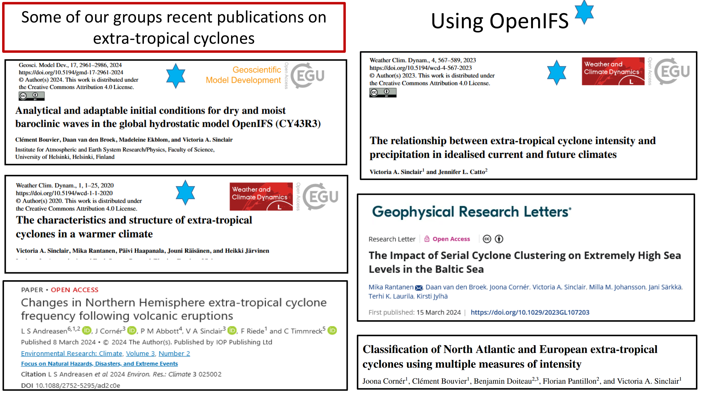
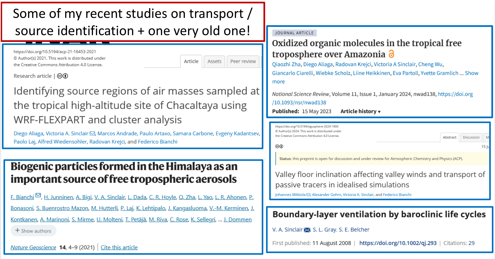

# EC-Earth
<div class="column">
- EC-Earth is one ESM, developed by a consortium in Europe (grey shaded countries)
- <https://gmd.copernicus.org/articles/15/2973/2022/>
</div>

<div class="column">

</div>

# EC-Earth 
<div class="column" style="width:60%">
- Contains many different models of different parts of the Earth System
- These need to be coupled together – can be a computational bottleneck
</div>

<div class="column" style="width:35%">

</div>

# EC-Earth 
<div class="column" style="width:60%">
- Many variables need to be passed back and forward between the different components of an ESM.
- Red arrows with numbers indicate the time frequency that variables are passed
  - range from 45 minutes to 1 year depending on the processes
- Traditionally chemistry was a separate model, now moving to combine it with the atmospheric model
</div>
<div class="column" style="width:35%">

</div>

# EC-Earth 
<div class="column">
Variables that are passed from the atmosphere model (IFS) to the Chemistry Transport model (TM5) in EC-Earth3 and vice-versa.
</div>
<div class="column">

</div>

# Part 5: Remaining challenges

# Remaining challenges
- What do you think the biggest challenges are in:
	- Numerical Weather Prediction?
   -  Earth System modelling? 
 
- Discuss with the people next to you

# Remaining challenges
- Many extreme events occur on small scales are our models do not resolve them well
- To have higher resolution models, requires more computing power - or more computationally efficient models
- Including more and more processes increases computational cost
- Almost all NWP and ESM models are written in Fortran

# A few words about my own research
 - If you are interested, have similar interests please come and talk to me

#
{width=80%}

#
{width=80%}

 

# Thank you

Any questions?

victoria.sinclair@helsinki.fi

# Useful textbooks
- "Atmospheric modeling, data assimilation and predictability" by Eugenia Kalnay (2003; Cambridge University Press).
- "Numerical weather and climate prediction" by Thomas Tomkins Warner (2011; Cambridge University Press).
- "Operational weather forecasting" by Peter Innes and Steve Dorling (2013; Wiley-Blackwell).
- "Basic Numerical Methods in Meteorology and Oceanography" by Kristofer Döös, Peter Lundberg, Aitor Aldama Campino  https://doi.org/10.16993/bbs 
<!--CHARNEY, J.G., FJÖRTOFT, R. and Von NEUMANN, J. (1950), Numerical Integration of the Barotropic Vorticity Equation. Tellus, 2: 237-254. https://doi.org/10.1111/j.2153-3490.1950.tb00336.x

# Quick cut-n-paste snippets for easy reference

Two columns:

<div class="column">
- Hello
</div>
<div class="column">

</div>

<!--Image: 

Code block:

```
```

New section:

# New section {.section}

-->
