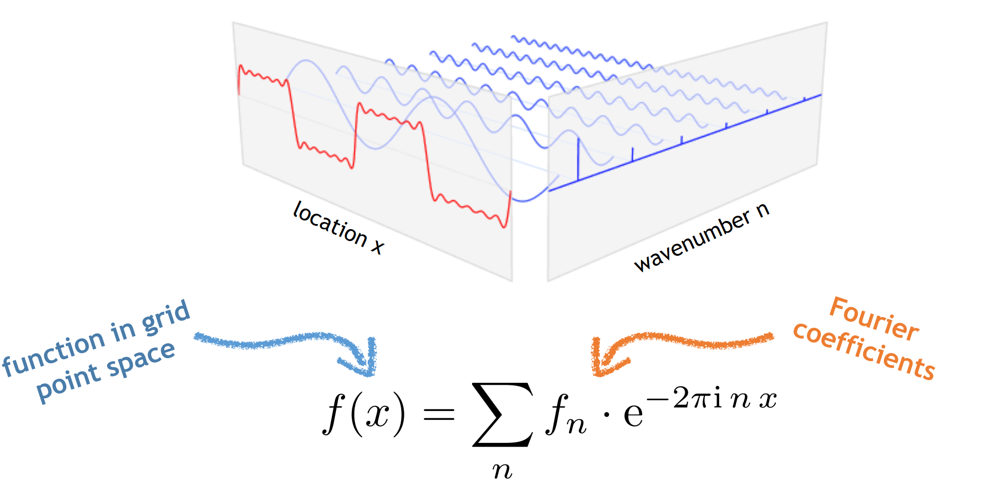
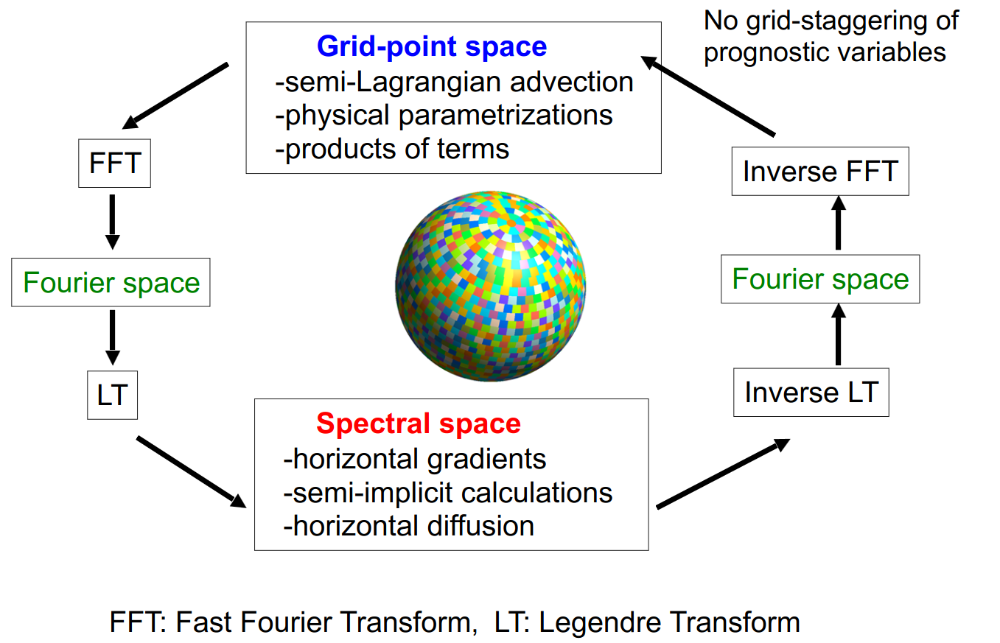
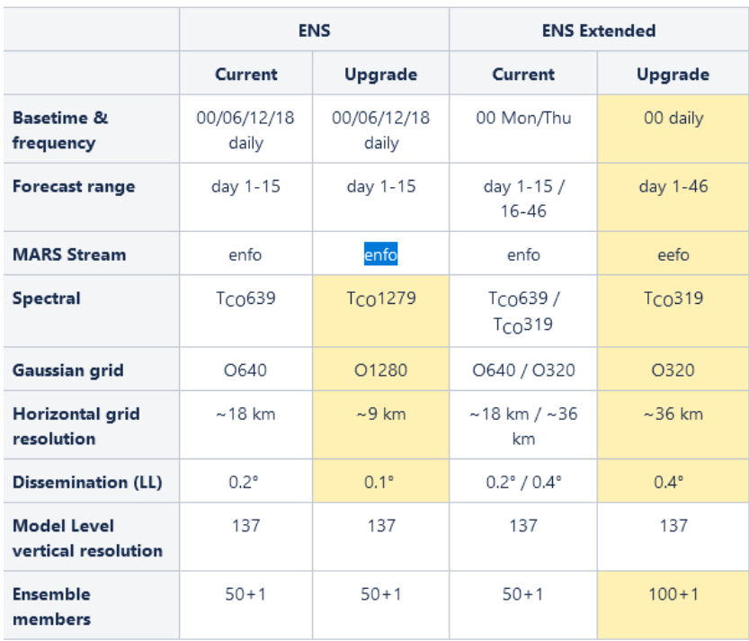
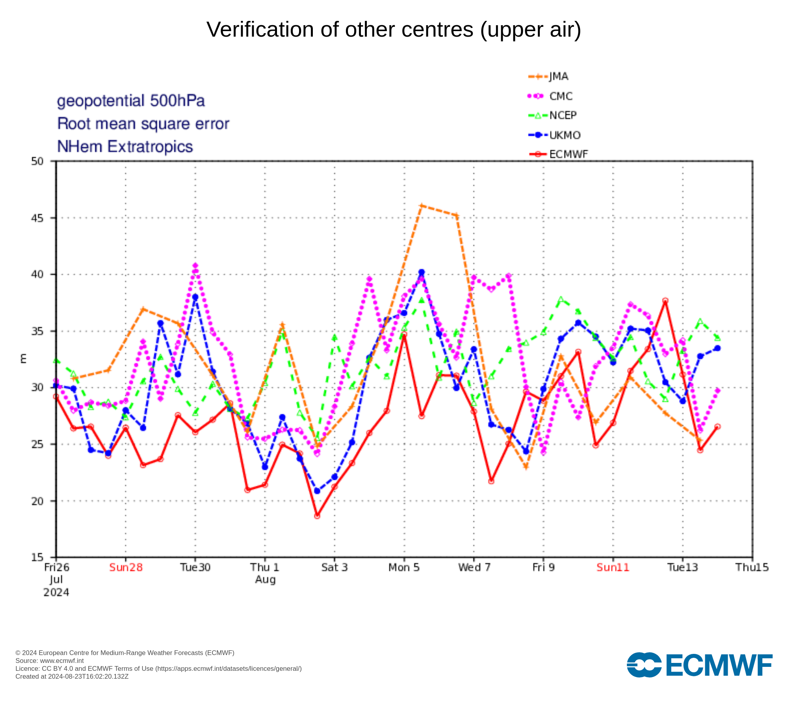
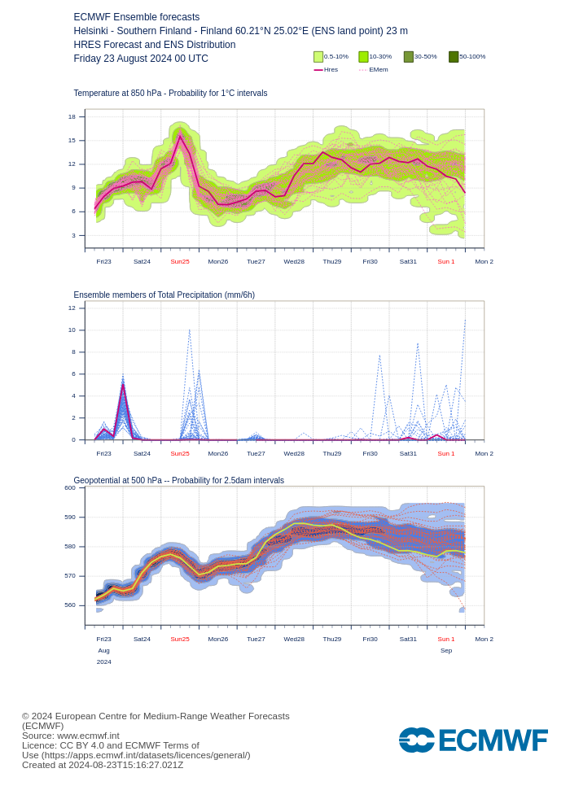

# Spectral models - an alternative to finite differences
- An alternative way to compute spatial and time derivatives
- Both methods (grid point / finite difference models and spectral models) have advantages and disadvantages
- Numerical methods used to solve the equations differs between grid point and spectral models

- Give a quick overview to the spectral method 
  - more in-depth detail can be found in the references listed at the of the slides
  - some material from Andreas Muller, ECMWF
  

# Spectral methods
- Key idea is to decompose the meteorological fields into a series of spectral harmonics in two dimensions
- Similar to how a Fourier series decomposes a 1-D data set (e.g. timeseries) into a series of sines and cosines
- Represent the spatial variations of variables as a finite series of waves of differing wavelengths.
- Best suited to global models as these are periodic: $u(x) = u(x+2π)$

<!--# Fourier series
 $$\Phi = e^{i(kx + ly)} $$
 $$\frac{\partial \Phi}{\partial x} =  ik \Phi   $$


- Differentiation now becomes multiplication
- Spatial derivatives can be computed analytically and very fast
-->

# Spectral methods 


# Spectral methods 

 Differentiation now becomes multiplication

# Spectral models - resolution
- Resolution is a function of the number of waves used in the model
- Model resolution is limited by the maximum number of waves
- Often discussed in terms of truncation (truncated series)
  - very short waves are not represented
  
# Spectral models - resolution
- Example: Fourier series truncation 10 means there are 10 sine terms, 10 cosine terms, plus a mean term
- IFS uses triangular truncation of spherical harmonics, e.g. T159, T255, T511, or T1279 number of terms (“T” for triangular)


# Challenges with spectral models
- Dealing with the output
- The Earth is not flat and also has 2 spatial dimensions - not so simple as a Fourier transform
- The "Physics" and non-linear terms still need to be computed in grid point space
  
   
# Challenge #1: Model output
- The state variables are stored as amplitudes of the spherical harmonics
- Explains the complicated model output 
 - Some variables saved in grid point space, other as spectral coefficients
 - Can have two files for each output timestep


# Challenge #2: Spectral decomposition on a sphere


# Challenge #2: Spectral decomposition on a sphere
- W-E (periodic): sine and cosine (zonal wavenumbers, m)
- S-N (non-periodic): Legendre polynomials
- m = zonal wavenumbers, n=total wavenumbers

# Challenges #3: transform between spectral and grid point space
- The "Physics" and non linear terms still need to be computed in grid point space
   - need to constantly transform between spectral and grid point space
- For high resolution, this becomes computationally expensive
  - 9 km grid spacing = 24% of run time for spectral transform
  - 5 km grid spacing = 31%
  - 1.25 km grid spacing = 41%
   
# Timestep in a spectral model   

   


# Spectral transform method

Short practical:
<https://anmrde.github.io/spectral/>


# Part 3: State of NWP today & Reanalysis

# State of NWP today
<div class="column">
<div style=font-size:0.8em>
- Many different global and limited area NWP models have been developed and are run operationally
- Forecast accuracy has increased at a rate of about 1 day per decade
- A 5-day weather forecast today is as accurate as a 4-day forecast was 10 years ago
- Weather Forecasts are now very accurate and save many lives and huge amounts of money each year
- (communicating them to the public and stakeholders is still a huge challange)
 </div>
  </div>
<div class="column">


<div style=font-size:0.4em> Bauer, P., Thorpe, A. & Brunet, G. The quiet revolution of numerical weather prediction. Nature 525, 47–55 (2015). <https://doi.org/10.1038/nature14956> </small>
 </div>
 </div>
 
# The Integrated Forecast System (IFS)
<div class="column" style="width:50%">
<div style=font-size:0.8em>
 - Developed by the European Centre for Medium Range Weather Forecasting (ECMWF)
 - "System" includes the forecast (NWP) model **and**  observation processing **and** data assimilation scheme
 - Now coupled to a dynamical ocean model, NEMO.
 - Written in Fortran
 - OpenIFS is a version of the IFS that is available to universities and research institutes. 
	 - now includes basic aerosol and chemistry
 </div>
  </div>
<div class="column" style="width:45%">

 </div>	 
 
 
# ICON (Icosahedral Nonhydrostatic) Model
<div class="column" style="width:75%"> 
<div style=font-size:0.8em>
-  ICON (ICOsahedral Nonhydrostatic) is a modeling framework for weather and climate
-  Solves the full three-dimensional non-hydrostatic and compressible Navier-Stokes equations on an icosahedral grid 
-  Allows for predictions from local to global scales
-  Jointly developed by the German Weather Service (DWD), the Max Planck Institute for Meteorology (MPI-M), the German Climate Computing Center (DKRZ) and the Karlsruhe Institute for Technology 
-  <https://www.icon-model.org/>
- Lots more about ICON later this week!
</div>
</div>

<div class="column" style=width:20%>

</div>

# RMSE for 6 different global NWP models
<div class="column">

</div>

<div class="column">
- 5-day forecasts of the 500-hPa geopotential height over the past 5 weeks from 5 different global models
- RMSE averaged over the northern hemisphere extra-tropics
- Some periods are easier to predict than others
- Some weather patterns are easier to predict.
</div>


# Ensemble Forecasting (1)
<div class="column" style="width:60%">
- The atmospheric is inherently chaotic
- Small errors will grow and become larger as forecast length increases
- All forecasts / NWP models have two types of errors:
- initial state errors as we do not know the initial state of the atmosphere perfectly
- model formulation errors - we cannot resolve all processes perfectly
</div>
<div class="column" style="width:35%">

<div style=font-size:0.4em>  
https://www.e-education.psu.edu/meteo810/content/l4_p6.html </div>
</div>

# Ensemble Forecasting (2)
- Ensemble forecasting aims to obtain estimates of predictability and forecast skill
- Ensemble forecasts involve producing a set of different forecasts given an initial weather situation.
- Two approaches to create the different forecasts:
- Perturb the initial conditions to account for initial condition uncertainty
- Apply small stochastic perturbations to the model physics to account for uncertainties in the model formulation.

# Ensemble Forecasting (3)
- Used operationally by most national weather forecast agencies for weather, sub seasonal and seasonal forecasting
- Also used in the climate modelling community
- Less common in climate modelling due to the large computational expense but can be very useful
	- Multi-model ensembles are more commonly used
	
	
# Example Ensemble Weather Forecast
<div class="column" style="width:40%">
{.center}
</div>

<div class="column" style="width:50%">
<div style=font-size:0.8em>
- "Meteogram" from ECMWF for Helsinki
- Forecast from last Friday, covers the time period until Monday 2nd
- boxes show the spread in the ensemble (10 - 90th percentiles)
- lines show the max and min values
- from www.ecmwf.int </div>
</div>

# Example Ensemble Weather Forecast
<div class="column" style="width:40%">
{.center}
</div>

<div class="column" style="width:50%">
- "Plumes diagram" for same location / dates as last slide
- Spread (uncertainity) increases with forecast length
- from www.ecmwf.int
</div>

# Example Ensemble Weather Forecast
{.center width=65%}
Can compute probabilities of certain weather events, e.g. temperature exceeding 25C  (from www.ecmwf.int)


# Reanalysis data
<div class="column" style="width:60%">
- Combination of model and observations
  - Data assimilation
- Can be considered our best guess of the state of the atmosphere but not complete “truth”
- Gridded datasets – 4 dimensional (x,y,z,t)
- Contains hundreds of variables
	- temperature, winds, cloud properties, rain, snow, soil temperature etc
</div>
<div class="column" style="width:35%">

<div style=font-size:0.4em>https://www.ecmwf.int/en/about/media-centre/science-blog/2017/era5-
new-reanalysis-weather-and-climate-data   </div>
</div>

# ERA5 Reanalysis
- One of the most commonly used reanalysis
- Developed by the European Centre for Medium Range Forecasts (ECWMF)
- Available at 1 hourly temporal resolution from the 1st January 1940 – present
- 0.25 degree horizontal grid spacing
- 137 model levels, data also on 37 pressure levels
- Huge data set ~5 petabytes
- Openly available: https://cds.climate.copernicus.eu
- Ideal training dataset for ML models


# Part 4: What are Earth System Models (ESMs)

# Earth System Models
- How do these differ from a numerical weather prediction model?

# Earth System Models
- Includes all aspects of the Earth system - physical, chemical and biological processes – not just the atmosphere
- Includes the global carbon cycle, dynamic vegetation, atmospheric chemistry, ocean bio-geo-chemistry and ice sheets
- Many different sub-models that are coupled together - massive amount of code!
- These models participate in CMIP (Coupled Model Intercomparison Project)
- Atmospheric part is the same dynamics + physics (and sometimes even the same code) as NWP models


# Earth System Models - feedbacks
- Allow for complex feedbacks to be modelled
- Two examples:
	- increasing CO_2 emissions -> increased temperatures -> sea ice loss -> increased albedo -> increased temperatures
	- increased temperatures -> more biogenic emissions from vegetation -> potentially more aerosol -> more CCN -> diffreent cloud properties
	
- many more feedbacks exist!


# EC-Earth
<div class="column">
- EC-Earth is one ESM, developed by a consortium in Europe (grey shaded countries)
- <https://gmd.copernicus.org/articles/15/2973/2022/>
</div>

<div class="column">

</div>

# EC-Earth 
<div class="column" style="width:60%">
- Contains many different models of different parts of the Earth System
- These need to be coupled together – can be a computational bottleneck
</div>

<div class="column" style="width:35%">

</div>

# EC-Earth 
<div class="column" style="width:60%">
- Many variables need to be passed back and forward between the different components of an ESM.
- Red arrows with numbers indicate the time frequency that variables are passed
  - range from 45 minutes to 1 year depending on the processes
- Traditionally chemistry was a separate model, now moving to combine it with the atmospheric model
</div>
<div class="column" style="width:35%">

</div>

# EC-Earth 
<div class="column">
Variables that are passed from the atmosphere model (IFS) to the Chemistry Transport model (TM5) in EC-Earth3 and vice-versa.
</div>
<div class="column">

</div>

# Part 5: Remaining challenges

# Remaining challenges
- What do you think the biggest challenges are in:
	- Numerical Weather Prediction?
   -  Earth System modelling? 
 
- Discuss with the people next to you

# Remaining challenges
- Many extreme events occur on small scales are our models do not resolve them well
- To have higher resolution models, requires more computing power - or more computationally efficient models
- Including more and more processes increases computational cost
- Almost all NWP and ESM models are written in Fortran

# A few words about my own research
 - If you are interested, have similar interests please come and talk to me

#
{width=80%}

#
{width=80%}

 

# Thank you

Any questions?

victoria.sinclair@helsinki.fi

# Useful textbooks
- "Atmospheric modeling, data assimilation and predictability" by Eugenia Kalnay (2003; Cambridge University Press).
- "Numerical weather and climate prediction" by Thomas Tomkins Warner (2011; Cambridge University Press).
- "Operational weather forecasting" by Peter Innes and Steve Dorling (2013; Wiley-Blackwell).
- "Basic Numerical Methods in Meteorology and Oceanography" by Kristofer Döös, Peter Lundberg, Aitor Aldama Campino  https://doi.org/10.16993/bbs 
<!--CHARNEY, J.G., FJÖRTOFT, R. and Von NEUMANN, J. (1950), Numerical Integration of the Barotropic Vorticity Equation. Tellus, 2: 237-254. https://doi.org/10.1111/j.2153-3490.1950.tb00336.x

# Quick cut-n-paste snippets for easy reference

Two columns:

<div class="column">
- Hello
</div>
<div class="column">

</div>

<!--Image: 

Code block:

```
```

New section:

# New section {.section}

-->
