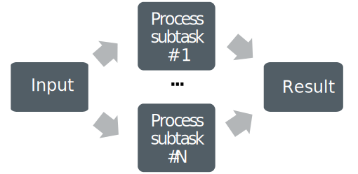

# Where to find the summer school material

- For slides see: https://csc-training.github.io/esiwace-summerschool-2024/
- For hands-on and exercises see: https://github.com/csc-training/esiwace-summerschool-2024

# What is high-performance computing

- Utilizing computing power that is much larger than available in a typical desktop computer
- Performance of HPC systems (i.e. supercomputers) is often measured in floating point operations per second (flop/s)
    - For software, other measures can be more meaningful
- Currently, the most powerful system reaches > $10^{18}$ flop/s (1 Eflop / s)

# Technology is evolving fast

{.center width=55%}

# Top performance is keeping up

{.center width=55%}

# What are supercomputers used for? {.section}

# General use cases

- Simulations of very different scales
    - From subatomic particles to cosmic scales
- Problems with very large datasets
- Complex computational problems
- Problems that are hard to experiment on
    - Simulations with decade-long timescales
- Many of these are very time consuming, or even impossible to solve on a standard computer

# Application areas

- Fundamental sciences such as particle physics and cosmology
- Climate, weather and earth sciences
- Life sciences and medicine
- Chemistry and material science
- Energy, e.g renewable sources and fusion research
- Engineering, e.g. manufacturing and infrastructure
- etc.

# HPC for weather and climate

- Weather and climate is great application area for HPC
- With increasing compute power global numerical weather forecast models were able to increase their horizontal resolution from ~200km in the 1980s to less than 10km today and are able to run ensembles instead of single simulations greatly improving the forecast skill
- Coupled climate models allow simulating past, present and future climate and have greatly contributed to our understanding of climate change

# Example Blue Marble simulation


<a href="https://www.youtube.com/watch?v=Nict8tBs4IY">Video link</a>

{.center width=60%}

# Example Blue Marble simulation

* Simulated with the coupled climate model ICON consisting of atmosphere, ocean, and land model components
* Horizontal resolution of ~1.25km
* 90 vertical level in the atmosphere (335544320 grid points per level)
* 128 vertical level in the ocean (237102291 surface grid points)
* The atmosphere uses a time-step of 8s and the ocean 45s
* 900 nodes of Levante (128 cores per node, AMD EPYC Milan CPUs)
* Throughput of about 3 simulated days per day 

# Utilizing HPC in climate research

- In order to prepare you to efficiently use HPC for your scientific research this summer school aims to teach you:
  - Domain-specific knowledge and practices
  - Infrastructure awareness
  - Data pre- and postprocessing skills including data evaluation and visualisation
  - Parallel programming skills
  - Novel concepts for Earth System Modelling

# What are supercomputers made of? {.section}

# Schematic of a supercomputer

{.center width=40%}

# Schematic of a supercomputer

{.center width=55%}

# Parallel processing

- Modern (super)computers rely on parallel processing
- **Multiple** CPU cores (& accelerators (GPUs))
    - All but one of the top 10 fastest supercomputers in the world use GPUs
- Vectorization
    - A single instruction can process multiple data (SIMD)
- Instruction level parallelism and pipelining
    - Core executes multiple instructions in parallel (superscalar execution)
    - Core executes different parts of instructions in parallel

# Supercomputer Levante

- CPU partition:
  - 2982 compute nodes with 2 AMD 7763 Milan processors each (64 cores per processor, ~380000 cores total)
  - peak performance 14 PetaFLOPS
  - currently #92 in the Top500 list

- GPU partition:
  - 60 GPU nodes each equipped with 2 AMD 7763 Milan CPUs and 4 NVIDIA A100 GPUs
  - peak performance 2.8 PetaFLOPS

- Disk storage:
  - 130 Petabyte

# Working on Levante {.section}

# SSH login

* To connect to Levante use <br>
`ssh -Y <userid>@levante.dkrz.de` <br>
* This brings you to one of the five login nodes levante[2-6] which serve as an interface for the computer.  
* Login nodes (levante.dkrz.de) are only supposed for text editing and lightweight processing.
* For everything else jobs/allocations should be used.
* If you haven't done so yet you can follow the instructions [here](https://docs.dkrz.de/doc/levante/access-and-environment.html#public-key-authentication) to set up ssh keys to make repeated logins easier


# Jupyterhub

* For interactive Python work you can also log in to [https://jupyterhub.dkrz.de](https://jupyterhub.dkrz.de)
<br>

{.center width=50%}

* [DKRZ Jupyterhub Documentation](https://docs.dkrz.de/doc/software&services/jupyterhub/index.html)

# File systems

* There are three different storage spaces: **HOME**, **WORK**, and **SCRATCH**:
  * **HOME** is the file system where users’ sessions start upon login to Levante. It is backed up and should be used to store shell setup files, source codes, scripts, and important files. Additionally, data is stored on fast SSD-backed storage.
  * **WORK** is a project space shared between all users of a project. It provides disk space for large amounts of data, but it is not backed up. It can be used e.g. for writing raw model output and processing of data that is accessible to all project members.
  * **SCRATCH** is provided for temporary storage and processing of large data. To prevent the file system from overflowing, old data is automatically deleted. The granted retention period is 14 days.

# Hands-On I

* Log in via ssh to levante and go to your summer school work directory
* Clone the summer school repo:

```
git clone https://github.com/csc-training/esiwace-summerschool-2024
```
* Log in to https://jupyterhub.dkrz.de
* Select the kernel `0 Python 3 based on the module python3/unstable`

# Hands-On I 
* In the summer school directory you can find an example notebook: `esiwace-summerschool-2024/B2/L6/docs/examples.ipynb`
* Open it in jupyterhub
* Insert a cell at the beginning, which executes the following command: 
```
%pip install easygems
```
* Execute the whole notebook and check that everything worked
* End your session by going to `File -> Hub Control Panel` and click `stop`

# Partitions

* Levante nodes are grouped into partitions which are sets of nodes with associated limits for wall-clock time, job size, etc:
  * **compute** is intended for running parallel scientific applications. The compute nodes allocated for a job are used exclusively and cannot be shared with other jobs.
  * **shared** can be used to run small jobs not requiring a whole node for the execution, such that one node can be shared between different jobs.
  * **interactive** is intended for memory or compute intensive data processing and compilation tasks that should not run on the login nodes.
  * **gpu** is intended for GPU-aware scientific applications (e.g. via OpenACC programming), machine learning or interactive 3-dimensional data visualization via VirtualGL/TurboVNC.

# SLURM

* Levante uses the job scheduling system SLURM
* A concise cheat sheet for SLURM can be found [here](https://slurm.schedmd.com/pdfs/summary.pdf)
* The most important SLURM commands are shown in the following slides

# SLURM - sinfo

- **sinfo**: 
  - Show information about all partitions and nodes managed by SLURM as well as about general system state 
  - Has a wide variety of filtering, sorting, and formatting options
- Example: Get information on the interactive partition
```
> sinfo -p interactive
PARTITION   AVAIL  TIMELIMIT  NODES  STATE NODELIST
interactive    up   12:00:00      8    mix l[40050,40054,40058-40060,40062-40063,40065]
interactive    up   12:00:00     10  alloc l[40048-40049,40051-40053,40055-40057,40061,40064]
interactive    up   12:00:00      4   idle l[40066-40069]
```
# SLURM - squeue

- **squeue**:
  - Query the list of pending and running jobs
  - By default it reports the list of pending jobs sorted by priority and the list of running jobs sorted separately according to the job priority
  - The most relevant job states are running (R), pending (PD), completing (CG), completed (CD) and cancelled (CA)
- Example: Get information on the status of your jobs
```
> squeue -u $USER
             JOBID PARTITION     NAME     USER ST       TIME  NODES NODELIST(REASON)
          10947275   compute cpu_chec  k202113 PD       0:00      1 (Priority)
          10947472   compute cpu_chec  k202113 PD       0:00      1 (Dependency)
          10947352   compute cpu_chec  k202113  R       6:35      1 l10094
          10940787       gpu exp.Next  k202113 PD       0:00     32 (BeginTime)
```

# SLURM - sbatch

- **sbatch**:
  - Submit a batch script. 
  - The script will be executed on the first node of the allocation
  - The working directory coincides with the working directory of the sbatch directory 
  - Within the script one or multiple srun commands can be used to create job steps and execute parallel applications
- Example: Submit your job script `my_script.run`
```
> sbatch my_script.run
```

# SLURM - scancel

- **scancel**:
  - Cancel a pending or running job or job step
- Example: Cancel your job `<jobid>`
```
> scancel <jobid>
```

# SLURM - salloc

- **salloc**:
  - Request interactive jobs/allocations
  - When the job starts, a shell (or other program specified on the command line) is started on the allocated node
  - The allocation is released when the user exits the shell or cancels the job
- Example: Reserve resources and jump directly to the assigned node
```
> salloc -p interactive -A <account> --mem=20G --x11
salloc: Pending job allocation 10948216
salloc: job 10948216 queued and waiting for resources
salloc: job 10948216 has been allocated resources
salloc: Granted job allocation 10948216
salloc: Waiting for resource configuration
salloc: Nodes l40050 are ready for job
```

# SLURM - srun

- **srun**:
  - initiate parallel job steps within a job or start an interactive job
- Example: 
```
> srun ./my_program
```

# Batch scripts

- A job allocation, which is a set of computing resources (nodes or cores) assigned to a user’s request for a specified amount of time, can be created using the SLURM **salloc**, **sbatch** or **srun** commands 
- The **salloc** and **sbatch** commands make resource allocations only
- The **srun** command launches parallel tasks and implicitly creates a resource allocation if not started within one
- The usual way to allocate resources and execute a job on Levante is to write a batch script and submit it to SLURM with the **sbatch** command
- The batch script is a shell script consisting of two parts: resources requests and job steps

# Example batch script

```bash
#!/bin/bash
#SBATCH --partition=compute
#SBATCH --account=xz0123
#SBATCH --nodes=1
#SBATCH --ntasks-per-node=128
#SBATCH --time=00:30:00

# Begin of section with executable commands
set -e
ls -l
srun ./my_program
```
For more info see [here](https://docs.dkrz.de/doc/levante/running-jobs/slurm-introduction.html#allocating-resources-with-slurm)

# Software packages

- To cover the software needs of DKRZ users and to maintain different software versions, the DKRZ uses the module environment 
- Loading a module adapts your environment variables to give you access to a specific set of software and its dependencies
- The most important commands are:
  - **`module avail`**: Shows the list of all available modules
  - **`module load <modulefile>`**: Loads selected module
  - **`module list`**: Lists all modules currently loaded
  - **`module rm <modulefile>`**: Unloads selected module
  - **`module purge`**: Unloads all modules

# Hands-On II

* Log in to levante and go to your summer school work directory
* In the folder `esiwace-summerschool-2024/B1/L2/exercises` you find some example programs
* Check the available modules
* Load the gcc compiler
* Compile the program `hello_world.f90`:
```
gfortran hello_world.f90 -o a.out
```
* Use `salloc` to allocate 4 cores of 1 node in the `shared` partition and execute the program there

# Hands-On II

* Check for available openmpi modules and load the one built with gcc
* Compile the program `hello_world_mpi.f90`:
```
mpifort hello_world_mpi.f90 -o b.out
```
* Execute the program
* If successfull end your allocation
* Write a batch script that executes the program on 8 cores of 1 nodes in the `shared` partition

# Parallel computing and programming {.section}

# Computing in parallel

- Parallel computing
    - A problem is split into smaller subtasks
    - Multiple subtasks are processed simultaneously using multiple cores

<!-- Copyright CSC -->
 {.center width=40%}

# Types of parallel problems

- Tightly coupled
    - Lots of interaction between subtasks
    - Weather simulation
    - Low latency, high speed interconnect is essential
- Embarrassingly parallel
    - Very little (or no) interaction between subtasks
    - Sequence alignment queries for multiple independent sequences in bioinformatics


# Exposing parallelism

<div class=column>
- Data parallelism
    - Data is distributed across cores
    - Each core performs simultaneously (nearly) identical operations with different data
    - Cores may need to interact with each other, e.g. exchange information about data on domain boundaries
</div>
<div class=column>

<!-- Copyright CSC -->
 {.center width=80%}

</div>

# Exposing parallelism

- Task farm (master / worker)

<!-- Copyright CSC -->
 {.center width=60%}

<br>

- Master sends tasks to workers and receives results
- There are normally more tasks than workers, and tasks are assigned dynamically

# Parallel scaling

<div class=column>
- Strong parallel scaling
    - Constant problem size
    - Execution time decreases in proportion to the increase in the number of cores
- Weak parallel scaling
    - Increasing problem size
    - Execution time remains constant when number of cores increases in proportion to the problem size
</div>
<div class=column>

<!-- Copyright CSC -->
 {.center width=80%}

</div>

# What limits parallel scaling

<div class=column style=width:60%>
- Load imbalance
    - Variation in workload over different execution units
- Parallel overheads
    - Additional operations which are not present in serial calculation
    - Synchronization, redundant computations, communications
- Amdahl’s law: the fraction of non-parallelizable parts limits maximum speedup
</div>
<div class=column style=width:38%>
  {.center width=100%}
</div>


# Parallel programming {.section}

# Programming languages

- The de-facto standard programming languages in HPC are (still!)
  C/C++ and Fortran
- Higher level languages like Python and Julia are gaining popularity
    - Often computationally intensive parts are still written in C/C++
      or Fortran

# Parallel programming models

- Parallel execution is based on threads or processes (or both) which run at the same time on different CPU cores
- Processes
    - Interaction is based on exchanging messages between processes
    - MPI (Message passing interface)
- Threads
    - Interaction is based on shared memory, i.e. each thread can access directly other threads data
    - OpenMP, pthreads

# Parallel programming models

<!-- Copyright CSC -->
 {.center width=80%}
<div class=column>
**MPI: Processes**

- Independent execution units
- MPI launches N processes at application startup
- Works over multiple nodes
</div>
<div class=column>

**OpenMP: Threads**

- Threads share memory space
- Threads are created and destroyed  (parallel regions)
- Limited to a single node

</div>

# GPUs

- GPUs are co-processors to the CPU
- CPU controls the work flow:
  - *offloads* computations to GPU by launching *kernels*
  - allocates and deallocates the memory on GPUs
  - handles the data transfers between CPU and GPUs
- GPU kernels run multiple threads
    - Typically much more threads than "GPU cores"
- When using multiple GPUs, CPU runs typically multiple processes (MPI) or multiple threads (OpenMP)

# GPUs

{.center width=40%}
<br>

- CPU launches kernel on GPU
- Kernel execution is normally asynchronous
    - CPU remains active
- Multiple kernels may run concurrently on same GPU

# GPU programming models

- Directive-based programming models like OpenACC or OpenMP
- Vendor-specific language extensions like CUDA (NVIDIA), HIP (AMD) or SYCL (Intel)
- C++ abstraction libraries like Kokkos or RAJA
- For some applications there are high-level frameworks with
  interfaces to multiple languages
    - PETSc, Trilinos
    - TensorFlow, PyTorch for deep learning

# Outlook

- Much more on this in the lectures on MPI, OpenMP and GPU programming later in the week


