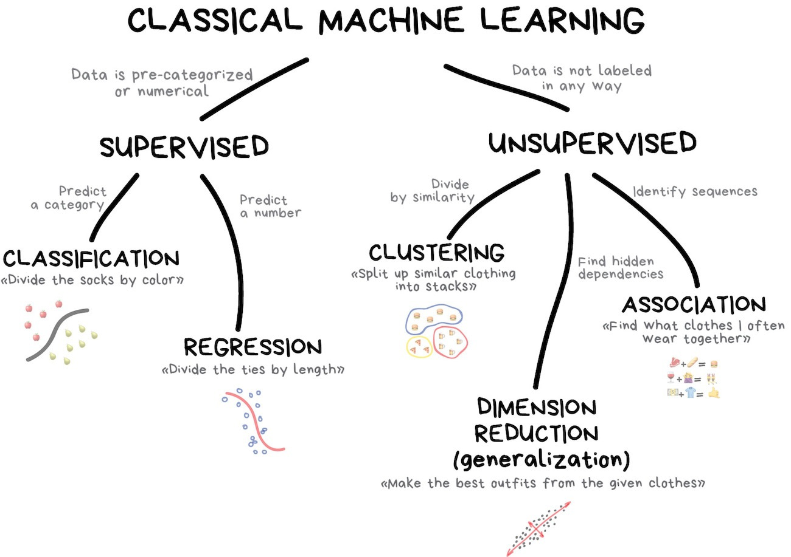
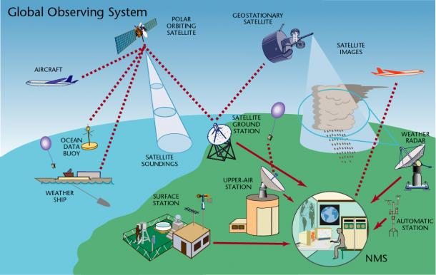
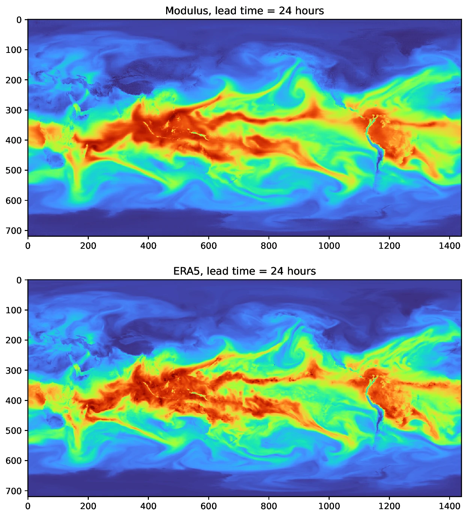

# Basics of Artificial Intelligence (AI)

- AI is technology that enables computers and machines to simulate human learning, comprehension, problem solving, decision making, creativity and autonomy (IBM)

- AI encompasses a broad range of techniques and approaches, including expert systems, natural language processing, computer vision, and robotics

- In the context of climate science, AI is mainly used for analysing vast amounts of data, recognising patterns, and making predictions based on complex datasets

# Basics of Machine Learning (ML)

- ML is a subset of AI that allows computers to learn from and make decisions based on data

- ML algorithms identify patterns in data and use those patterns to make predictions or decisions

# The three categories of ML

- **Supervised Learning:** The algorithm is trained on a labeled dataset, meaning that the input data is paired with the correct output (**classification, regression**).

- **Unsupervised Learning:** The algorithm is given data without explicit instructions on what to do with it. It seeks to find the structure or patterns in the data, utilising, e.g., **clustering** or **dimensional reduction**.

- **Reinforcement Learning:** The algorithm learns by interacting with its environment, receiving **rewards** or **penalties** based on its actions, and refining its strategy to maximize rewards.

# 

{.center width=65%}

# What is this data we keep talking about

{.center width=65%}

# Relevance of AI and ML to Earth system sciences

- Improve understanding by fusing information 
    - Data exploration, causal discovery, uncertainty quantification, bias correction, downscaling, regional modelling, parameter optimisation of sub-grid processes

- Speed up simulations
    - Emulate model components / processes, optimise and port to heterogenous hardware
    - Use reduced numerical precision and sparse machine learning
    - Data compression

- Link new communities and data sources
    - Health, energy, transport, pollution, extremes

# Challenges and considerations

- Data required and/or produced by climate models is usually temporal
    - Need to account for, e.g., autocorrelation, lag, trends and seasonality

- ML models performance depends on the quality and quantity of the data they are trained on
    - Gaps in data or biases in datasets can lead to inaccurate predictions

- The more complex ML-models are often referred to as “black box” models, since it is difficult to interpret how they arrived at specific predictions (expecially when understanding the underlying physical processes is crucial)
    - We will shortly touch on explainable AI (XAI) in the end of the lectures

# What about NWP?

- Multiple new ML-based approaches to simulate weather forecasts (all with ERA5)
    - Nvidia's FourCastNet (Fourier ForeCasting Neural Network)
    - Google's NeuralGCM and GraphCast
    - Huawei's Pangu-Weather model
    - ECMWF's AIFS

- https://www.youtube.com/watch?v=nuT_U1AQz3g

{.center width=600}

 FourCastNet Fig. 101 24 hour prediction of the integrated vertical column of atmospheric water vapor predicted by Modulus Sym compared to the ground truth ERA5 dataset from ECMWF.

# Time for some exercises

- Choose based on your background:
    - https://github.com/csc-training/intro-to-ml/
    - https://github.com/csc-training/intro-to-dl/

- You can choose another dataset
    - https://archive.ics.uci.edu/
    - MNIST and Fashion-MNIST are very large
    - e.g. IRIS for classification or Auto MPG for regression