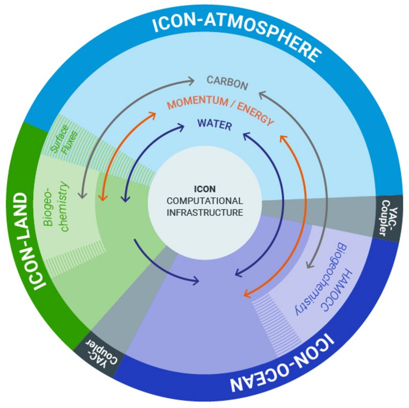
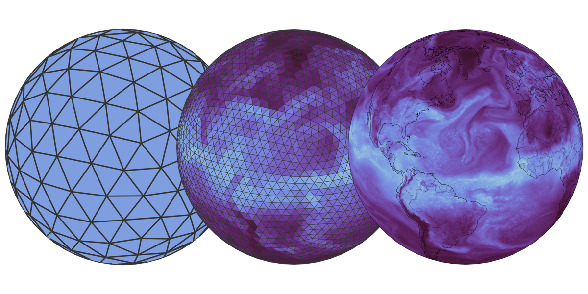
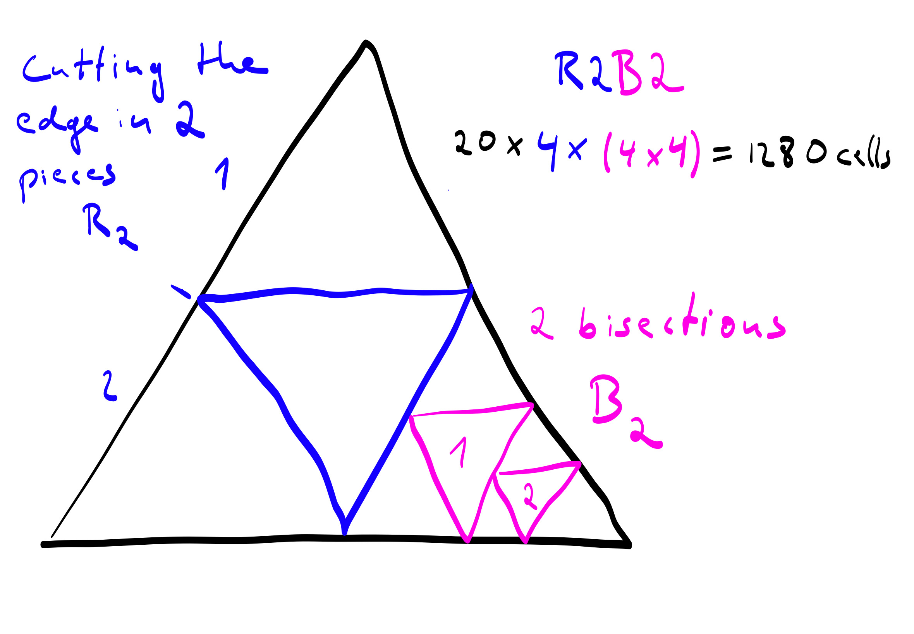
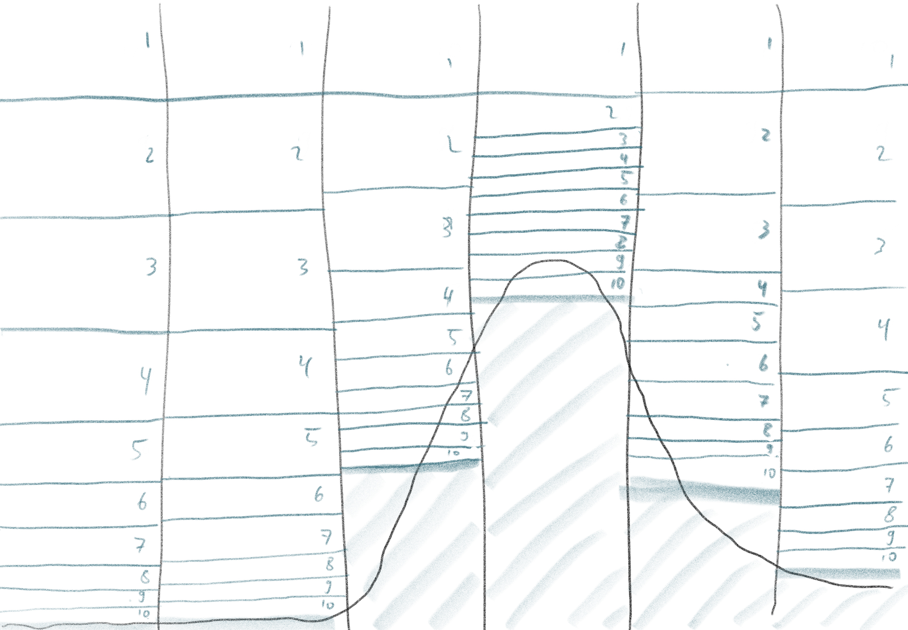
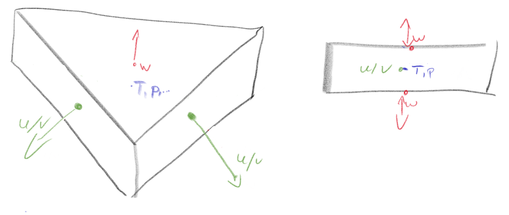
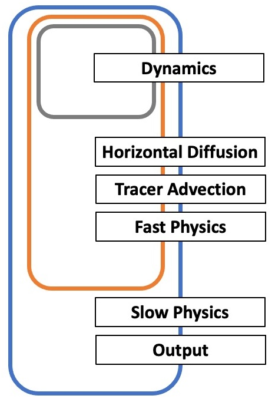

# What is ICON?

{.center width=15%}

- ICON stands for ICOsahedral Nonhydrostatic model and is a weather and climate model with atmosphere, ocean and land components
- Its development started more than two decades ago; initially by the German Weather Service (DWD) and the Max Planck Institute for Meterology (MPI-M), later joined by the Karlsruhe Institute for Technology (KIT) and the German Climate Computing Center (DKRZ) and latest the Swiss Center for Climate Systems Modeling (C2SM)
- Since January 2024 it is available under an open source license via https://www.icon-model.org/

# What are the components of ICON?

{.center width=35%}
Credit: Max Planck Institute for Meteorology (https://mpimet.mpg.de/en/research/modeling)

# What is ICON used for?

- ICON is used for applications ranging from numerical weather prediction to CMIP-type climate simulations to km-scale climate simulations

# ICON NWP

- Used for operational numerical weather prediction at DWD since 2015
- Other national weather services are using it as well; the latest being Meteo Swiss since June 2024

- DWD setup: 13 km global, 7 km over Europe, 2 km over Germany and surroundings (nested)


# ICON ESM

- Coupled model setup consisting of atmosphere (horizontal resolution 160km, 47 vertical level), ocean (horizontal resolution of 40km, 64 vertical level), land, and optionally ocean biogeochemistry
- Without ocean biogeochemistry it achieved a throughput of ~120 simulated years per day on 120 nodes on the DKRZ system Mistral (predecessor of Levante)
- see also [Jungclaus et al., 2022](https://doi.org/10.1029/2021MS002813)

# ICON at km-scales

- ICON is also one of few models worldwide that can be used for coupled simulations at km-scale allowing to directly simulate smaller scale features like storms or ocean eddies (see also [Hohenegger et al., 2023](https://doi.org/10.5194/gmd-16-779-2023))
- In the NextGEMS project a 30-year simulation was performed with the coupled model with atmosphere (10km horizontal resolution, 90 vertical level), ocean (5km resolution, 72 vertical level) and land components
- It achieved a throughput of ~1 simulated year per day on 472 nodes of Levante at DKRZ

# What are we going to do today?

- We want you to run your own ICON experiments!
- To do that you need to 
    - Get the ICON model code
    - Set up your environment and build the model
    - Create a run script
    - Run the model
    - Check the results 

# Let's get started

- Please pair up in teams of two (or one team of three if needed)
- Log in to levante and go to your work directory
- Get the model code and some helper scripts from Flo's repo:

```
git clone https://gitlab.dkrz.de/flo/icon_with_python.git 
```

- Go to the directory `icon_with_python` and execute the script `build.sh`

# What does the script actually do?

- It downloads and unpacks the ICON model code: `curl https://gitlab.dkrz.de/icon/icon-model/-/archive/release-2024.07-public/icon-model-release-2024.07-public.tar.gz | tar -xzf -`
- (You could also get the code via git: `git clone https://gitlab.dkrz.de/icon/icon-model.git`)

# What does the script actually do?

- Here we want to use a novel method of writing output named hiopy, for which the model is coupled to a python program that writes the data on a so-called healpix grid and which makes the later analysis of the data much easier (more on that in Flo's upcoming lectures)
- For that we need to set up a virtual environment in which we can later install the necessary python package
- Then we can actually build the ICON model

# How to build ICON?

- ICON is already regularly running on a number of HPC sites throughout Europe (like e.g. Levante at DKRZ, LUMI at CSC or JUWELS at JSC)
- Thus it comes with a number of configure scripts to set up the model on these systems (for examples look at your `icon/config` directory)
- For Levante you have a number of scripts based on different compilers and targeting either the CPU or the GPU partition of Levante
- For our example we want to run on the CPU partition and use the intel compiler, since it gives us the best performance

# How to build ICON?


```
../config/dkrz/levante.intel \
    --enable-python-bindings --with-pic \
    --enable-openmp \
    --disable-mpi-checks \
    --enable-comin

```

- There are a lot of options you can use when configuring the model
- For more information try 

```
./configure --help
```

- After the configure step was successful you can use `make` to actually build the model

# What does the script actually do?

- Finally, we need a run script
- ICON comes with a number of run script templates for different types of experiments, which you can find in the directory `icon/run`
- After successfully configuring the model you can use `make_runscripts` to create a run script based on such a template for your target system

```
if [ ! -f run/exp.esm_bb_ruby0_hiopy ]; then
    cp run/exp.esm_bb_ruby0 run/exp.esm_bb_ruby0_hiopy
    cat ../../hiopy_run_script_extension >> run/exp.esm_bb_ruby0_hiopy
fi
./make_runscripts esm_bb_ruby0_hiopy

```
# How is ICON programmed?

- ICON is written mosten in Fortran and consists of more than 1 million lines of code
- It uses a hybrid MPI/OpenMP approach for parallelisation
- The atmosphere and land components have been ported to GPUs using OpenACC directives
- Work is ongoing to port the remaining components

# What hardware can ICON run on?

* ICON is running and regularly tested on a variety of hardware architectures and can in principal run on everything from a laptop to the largest supercomputers in the world
* Standard CPU-systems like Levante (DKRZ)
* GPU-based systems (atmosphere and land) like Levante, Alps (CSCS, Meteo Swiss), LUMI (CSC) and JUWELS Booster (JSC)
* NEC vector (DWD)

# Where does the compute time go?

Assuming same resolutions in atmosphere and ocean:

* 98 % atmosphere and land
* 2 % ocean

Every doubling of the resolution costs a factor of 8 in compute time. 4 times as many grid cells, and half the time step length, as the wind/currents must not pass more than one grid cell per timestep (CFL, the numerics will blow up fast).

nextGEMS R2B8/R2B9: 84% atmosphere, 14% ocean, 2.5% output

# The ICON model grid

{.center width=35%}

- Base structure: Icosahedron (20 triangles) covering Earth
- Subdivisions into smaller triangles

- R**X**B**Y** notation 
  - **X** being the number of pieces the edges of the original triangles are divided into 
  - **Y** the number of follow-up Bisections. 

# The ICON MODEL grid

{width=60%}

# The vertical coordinates

{width=60%}

# The grid cell



# The ICON atmosphere time loop

<div class=column style=width:30%>



</div>
<div class=column style=width:65%>
- The dynamical core runs with additional substeps
- Fast physics include cloud microphysics and turbulence
- Slow physics is e.g. radiation
</div>

# What is in an ICON run script?

- SLURM settings:

```
#! /usr/bin/bash
#=============================================================================
#SBATCH --account=bb1153
#SBATCH --job-name=slo1684
#SBATCH --partition=compute
#SBATCH --nodes=4
#SBATCH --output=LOG.slo1684.%j.o
#SBATCH --exclusive
#SBATCH --mem=0
#SBATCH --time=06:00:00
#=============================================================================
```

# What is in an ICON run script?

- Parallelisation information:

```
#=============================================================================
# OpenMP environment variables
# ----------------------------
export OMP_NUM_THREADS=1
export ICON_THREADS=1
export OMP_SCHEDULE=dynamic,1
export OMP_DYNAMIC="false"
export OMP_STACKSIZE=200M
#
# MPI variables
# -------------
no_of_nodes=${SLURM_JOB_NUM_NODES:=4}
mpi_procs_pernode=$(( 128 * 1))
((mpi_total_procs=no_of_nodes * mpi_procs_pernode))
```

# What is in an ICON run script?

- srun command:

```
export START="srun -l --kill-on-bad-exit=1 --nodes=${SLURM_JOB_NUM_NODES:-1} //
              --distribution=block:cyclic --hint=nomultithread //
              --ntasks=$((no_of_nodes * mpi_procs_pernode)) //
              --ntasks-per-node=${mpi_procs_pernode} --cpus-per-task=${OMP_NUM_THREADS}"
```

# What is in an ICON run script?

- Grid information:

```
# (1) Basic grid configuration
# -----------------------------

atmos_gridID="0012"             #  icon-nwp grid
atmos_refinement="R02B04"

ocean_gridID="0035"             #  icon-oce ruby-0 grid
ocean_refinement="R02B06"

```

```
atmo_grid_target=iconR2B04_DOM01.nc
atmo_grid_folder="$ICONcoupled/Setup.proto2"
atmo_grid_source=icon_grid_${atmos_gridID}_R02B04_G.nc
add_link_file ${atmo_grid_folder}/${atmo_grid_source} ./$atmo_grid_target

```


# What is in an ICON run script?

- Time step information:

```
# (2) Define the model time stepping
# ----------------------------------
#
dtime=450                        # NWP atmospheric timestep (s)   (same as in atmTimeStep!!)
dt_rad=3600.                     # NWP radiation timestep (s) - must match coupling/ocean time step
oceTimeStep="PT30M"              # ocean time step
atmTimeStep="PT450S"             # atmos time step (for coupler)  (same as dtime!!)
couplingTimeStep="PT30M"         # coupling time step
```

# What is in an ICON run script?

- Paths to initial condition and boundary condition files

``` 
#  ifs2icon for grid 0012
add_link_file $INDIR/ifs2icon_2021010100_0012_R02B04_G.nc ifs2icon_R2B04_DOM01.nc

#-----------------------------------------------------------------------------
#
#   Kinne background aerosols for the year 1850 (irad_aero=12, filename without year)
#    - unified with code of icon-nwp
#
datadir=${atmo_grid_folder}
add_link_file ${datadir}/bc_aeropt_kinne_lw_b16_coa.nc                  ./
add_link_file ${datadir}/bc_aeropt_kinne_sw_b14_coa.nc                  ./
```

# What is in an ICON run script?

- Lots of namelists defining the model configuration
- e.g. defining which advection schemes to use for the different tracers

```
&transport_nml
 ivadv_tracer            = 3,3,3,3,3
 itype_hlimit            = 3,4,4,4,4,0
 ihadv_tracer            = 32,2,2,2,2,0
/
```

- For details on all the namelist settings see ICON_Namelist_Overview.pdf in your `/icon/doc` folder

# What is in an ICON run script?

- Another example -> radiation settings:

```
&radiation_nml
 irad_o3                 = 79
 irad_aero               = 12
 izenith                 = 4           ! 4: NWP default, 3: no annual cycle
 albedo_type             = 2 ! Modis albedo
 vmr_co2                 = 284.3e-06   !
 vmr_ch4                 = 808.2e-09   ! values for 1850 CE
 vmr_n2o                 = 273.0e-09   ! values for 1850 CE
 vmr_o2                  = 0.20946
 vmr_cfc11               = 0.0
 vmr_cfc12               = 0.0
 direct_albedo           = 4
 direct_albedo_water     = 3
 albedo_whitecap         = 1
 ecrad_llw_cloud_scat    = .true.
 ecRad_data_path         = '${ecRad_data_path}' 
/

```

# What is in an ICON run script?

- Coupling setup
- Output settings
- Restart information
- ...

# Preparing ICON experiments

- Was your build script successfull?
- If so, you should have your icon binary in `/icon_with_python/icon/build/bin`
- And a run script `exp.slo1684.run` in `/icon_with_python/icon/build/run`
- Let's modify your run scripts,so that we can run a variety of experiments

# Experiments

- Groups 1 and 2: Divide the greenhouse gas (GHG) concentrations by four
- Groups 3 and 4: Multiply the GHG concentrations by four
- Groups 5 and 6: Add 4 K to the ocean temperature reported to the atmosphere.
- Groups 7 and 8: Combine the effects of group 3/4 and 5/6
- Groups 9 and 10: Run the model as-is

Groups with even numbers, add 0.01 PPM (parts per million) to the CO2 concentration.

# Examples

# First look at your model data
