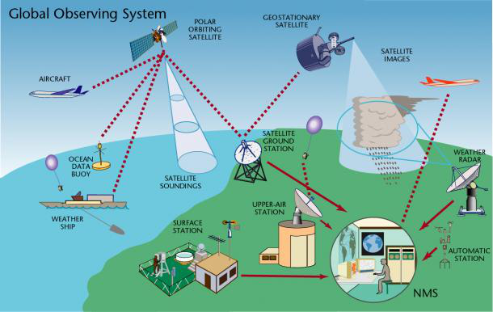

# Topics today

- Some general remarks on data management on a HPC system

- Focus on two data formats: NetCDF4 and zarr (and xarray)

- Finalize on a short overview of ESMValTool

# What kinds of data do we have?

{.center width=65%}

# The most common ESM data formats

- NetCDF (Network Common Data Form) is the "industry" standard in climate modelling and designed for the array-oriented scientific data
    - Supports large datasets, platform-independent and self-describing

- GRIB (Gridded Binary) is commonly used for meteorological and oceanographic data
    - Supports compression and often used by operational weather centers

- HDF (Hierarchical Data Format) is used in EO and satellite data
    - Under the hood of netCDF

- Zarr is the modern alternative for the above
    - Supports chunking, compression and can store metadata

# The ESM data standards

- The Climate Model Output Rewriter (CMOR) is a library used for generating CF-compliant NetCDF files to facilitate model output intercomparison for various Model Intercomparison Projects (MIPs)
    - Not all ESM's output CMOR compliant variables

- Earth System Grid Federation (ESGF) is planning to phase out CMIP3 and CMIP5 data

# NetCDF4 file operations

- Multiplatform and also supported by several python libraries
    - Recommendation to use `netCDF4` (with Python)

- A file can be open with three different options:
    - "w" to write a new file,
    - "r" to read only, and
    - "r+" to read and modify contents

```
import numpy as np
from netCDF4 import Dataset
ds = Dataset("test.nc", "w", format="NETCDF4")
```

# A typical netCDF4 file

- Typically a netCDF4 file in climate sciences contains
    - dimensions (time, level, lat, lon)
    - variables (CMOR standard or possibly not)
    - attributes detailing metadata such as units

- Groups and multi-file datasets and parallel reads/writes are also possible

- Before assigning values to variables, it and dimensions need to be created

# NetCDF4 basic syntax

```
time = ds.createDimension("time", "f8", None)
lat = ds.createDimension("lat", "f4", 180)
lon = ds.createDimension("lon", "f4", 360)

lat.units = "degrees_north"
lon.units = "degrees_east"
time.units = "days since 2000-01-01 00:00:00.0"
time.calendar = "gregorian"

lat[:] = np.linspace(-89.5, 89.5, 90)
lon[:] = np.linspace(-179.5, 179.5, 180)

tas = ds.createVariable("tas", "f4", ("time", "lat", "lon",))
tas.units = "K"  
tas.long_name = "Near-Surface Air Temperature"
tas[:, :, :] = 0.0 
```
# NetCDF4 continued

- NetCDF4 for python has a good documentation:
    - https://unidata.github.io/netcdf4-python/

- Supports parallellisation (with e.g. mpi4py)

- Try it out yourselves!
