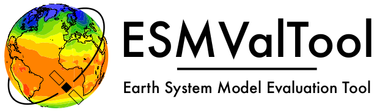

# Zarr and xarray

- Zarr is a format and library for the efficient storage of large, chunked, N-dimensional arrays
    - provides similar functionality to HDF5 (and netCDF4)
    - similar array interface to NumPy 
    - (should be) platform independent
    - designed to work with datasets that do not fit into memory

- Xarray is a data analysis library for labeled, multidimensional data
    - "expands" NumPy by adding labels to dimensions and coordinates, making it easier to work with multidimensional data
    - uses Zarr as one of its backends to efficiently store and access data

# Key features

- Zarr:
    - Chunking to allow efficient read/write operations on parts of the data
    - Compression to reduce storage requirements
    - Parallel I/O to enable faster data processing, e.g., with dask
    - Metadata can be stored in dictionary-like attributes (`attrs`) and/or array names and coordinate labels
    
- Xarray:
    - Labeled arrays to manage data with labeled dimensions and coordinates
    - Operations on specific dimensions using labels
    - Integration with Pandas
    - Can handle data from, e.g., netCDF, HDF5, GRIB, and Zarr

# Zarr array with 100 chunks

```
import zarr
import xarray as xr
z = zarr.zeros((10000, 10000), chunks=(1000, 1000), dtype='i4')

zarr.save('zarr_path', z)
x = xr.open_zarr(`zarr_path`)
```

- `chunks` means the size of a chunk
- when operating on an array, try to "respect" chunk boundaries
- many types of support to make this safe, e.g., chunk-level synchronization `synchronizer=zarr.ThreadSynchronizer()
- https://zarr.readthedocs.io/en/stable/tutorial.html

# Relation Between Zarr and xarray

- Store in zarr format, manage and analyse with xarray
    - xarray uses Zarr as one of its backends
    - leverage Zarr’s chunking and parallel I/O capabilities to work efficiently with big data

- When working with zarr datasets, xarray automatically lazily loads the data
    - data is loaded into memory when explicitly required for computation

- Additionally, through Zarr, xarray can read and write data directly to cloud storage solutions
    -  AWS S3, Google Cloud Storage, and other scalable storage backends

# Zarr groups

- Zarr groups are hierarchical containers used to store datasets and metadata

- Pseudocode

```
zf = zarr.open('example_group.zarr', mode='w') # new file
zg1 = zf.create_group("group1") # new group 
zd1 = zg1.create_dataset("mydata",data,chunks=(X,X,X) # new data
zg1.tree() # Prints the hierarchical structure of the group
```

# Try it out!

- More syntax: https://zarr.readthedocs.io/en/stable/tutorial.html
    - you can also use `timeit` for comparison with other options
    
- Use zarr to create and save a "large" dataset, splitting the data into chunks and compressing it
    - Open with xarray to access the Zarr dataset lazily
    - Check also usage differences between labels and metadata
    - Analyze with xarray labeled operations, averaging over dimensions etc.

- With the help of, for example google, try read parallellisation with dask and compute the zarr array average.
 
# ESMValTool

- Earth System Model Evaluation Tool (ESMValTool) is a community diagnostic and performance metrics tool for routine evaluation of Earth system models in CMIP
    - https://github.com/ESMValGroup/ESMValTool

{.center width=65%}

- https://www.youtube.com/watch?v=sidM4EB6Sbo&list=PLfNPd2rlkdzOxdo5tAZHS3VUeMFn2QwAj

# ESMValtool functionality

- Expects data in CMOR standardized form

- Has a lot of recipes/diagnostics based on scientific publications
    - You can also develop your own recipes

- Standard utilisation is relatively easy
    - utilising default configs
    - the tool can automatically download needed CMIP data

- Developing own diagnostics has a bit of a steeper learning curve
    - local / regional diagnostics not in the focus

