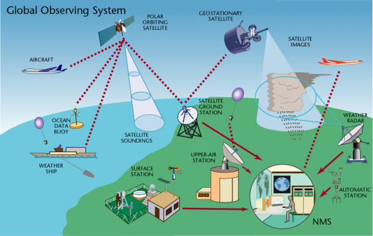

# Topics today

- Some general remarks on data management on a HPC system

- Focus on two data formats: NetCDF4 and zarr (and xarray)

- Finalize on an overview of ESMValTool

# What kinds of data do we have?

{.center width=65%}

# The most common ESM data formats

- NetCDF (Network Common Data Form) is the "industry" standard in climate modelling and designed for the array-oriented scientific data
    - Supports large datasets, platform-independent and self-describing

- GRIB (Gridded Binary) is commonly used for meteorological and oceanographic data
    - Supports compression and often used by operational weather centers

- HDF (Hierarchical Data Format) is used in EO and satellite data
    - Under the hood of netCDF

- zarr is the modern alternative for the above
    - Supports chunking, compression and can store metadata

# The ESM data standards

- The Climate Model Output Rewriter (CMOR) is a library used for generating CF-compliant NetCDF files to facilitate model output intercomparison for various Model Intercomparison Projects (MIPs)
    - Not all ESM's output CMOR compliant variables

- Earth System Grid Federation (ESGF) is planning to phase out CMIP3 and CMIP5 data

# NetCDF4 file operations

- Multiplatform and also supported by several python libraries
    - Recommendation to use `netCDF4` (with Python)

- A file can be open with three different options:
    - "w" to write a new file,
    - "r" to read only, and
    - "r+" to read and modify contents

```
import numpy as np
from netCDF4 import Dataset
ds = Dataset("test.nc", "w", format="NETCDF4")
```

# A typical netCDF4 file

- Typically a netCDF4 file in climate sciences contains
    - dimensions (time, level, lat, lon)
    - variables (CMOR standard or possibly not)
    - attributes detailing metadata such as units

- Groups and multi-file datasets and parallel reads/writes are also possible

- Before assigning values to variables, it and dimensions need to be created

# NetCDF4 basic syntax

```
time = ds.createDimension("time", "f8", None)
lat = ds.createDimension("lat", "f4", 180)
lon = ds.createDimension("lon", "f4", 360)

lat.units = "degrees_north"
lon.units = "degrees_east"
time.units = "days since 2000-01-01 00:00:00.0"
time.calendar = "gregorian"

lat[:] = np.linspace(-89.5, 89.5, 90)
lon[:] = np.linspace(-179.5, 179.5, 180)

tas = ds.createVariable("tas", "f4", ("time", "lat", "lon",))
tas.units = "K"  
tas.long_name = "Near-Surface Air Temperature"
tas[:, :, :] = 0.0 
```
# NetCDF4 continued

- NetCDF4 for python has a good documentation:
    - https://unidata.github.io/netcdf4-python/

- Supports parallellisation (with e.g. mpi4py)

- Try it out yourselves!

# Zarr and xarray

- Zarr is a format and library for the efficient storage of large, chunked, N-dimensional arrays
    - provides similar functionality to HDF5 (and netCDF4)
    - similar array interface to NumPy 
    - (should be) platform independent
    - designed to work with datasets that do not fit into memory

- Xarray is a data analysis library for labeled, multidimensional data
    - "expands" NumPy by adding labels to dimensions and coordinates, making it easier to work with multidimensional data
    - uses Zarr as one of its backends to efficiently store and access data

# Key features

- Zarr:
    - Chunking to allow efficient read/write operations on parts of the data
    - Compression to reduce storage requirements
    - Parallel I/O to enable faster data processing, e.g., with dask
    - Metadata can be stored in dictionary-like attributes (`attrs`) and/or array names and coordinate labels
    
- Xarray:
    - Labeled arrays to manage data with labeled dimensions and coordinates
    - Operations on specific dimensions using labels
    - Integration with Pandas
    - Can handle data from, e.g., netCDF, HDF5, GRIB, and Zarr

# Zarr array with 100 chunks

```
import zarr
import xarray as xr
z = zarr.zeros((10000, 10000), chunks=(1000, 1000), dtype='i4')
zarr.save('zarr_path', z)
x = xr.open_zarr(`zarr_path`)

```
- `chunks` means the size of a chunk
- when operating on an array, try to "respect" chunk boundaries
- many types of support to make this safe, e.g., chunk-level synchronization `synchronizer=zarr.ThreadSynchronizer()
- https://zarr.readthedocs.io/en/stable/tutorial.html

# Relation Between Zarr and xarray

- Store in zarr format, manage and analyse with xarray
    - xarray uses Zarr as one of its backends
    - leverage Zarr’s chunking and parallel I/O capabilities to work efficiently with big data

- When working with zarr datasets, xarray automatically lazily loads the data
    - data is loaded into memory when explicitly required for computation

- Additionally, through Zarr, xarray can read and write data directly to cloud storage solutions
    -  AWS S3, Google Cloud Storage, and other scalable storage backends

# Try it out!

- With e.g. the help of the tutorial
    - https://zarr.readthedocs.io/en/stable/tutorial.html
    - use can also use `timeit` to time the operations and compare with other options
    
- Use zarr to create and save a "large" dataset, splitting the data into chunks and compressing it

- Open with xarray to access the Zarr dataset lazily

- Check also differences between labels and metadata nad how to access

- Analyze with xarray_ labeled operations, averaging over dimensions etc.