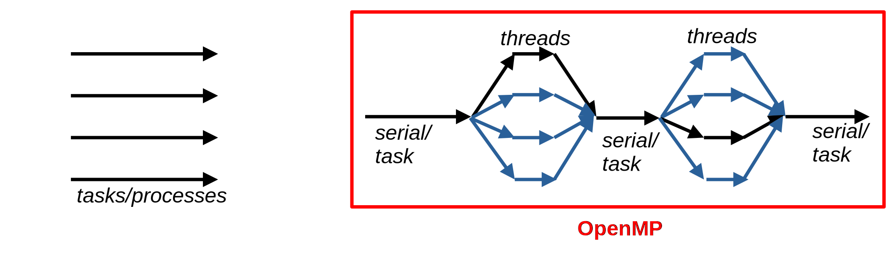

# Contents for parts I & II

- Two lectures + two exercise sessions; in Fortran

- Shared memory computing using multithread parallellization with OpenMP

- How to share workload with threads
    - Part I: Basic data and worksharing
    - Part II: OpenMP Tasks for dynamically sized workloads, a hybrid approach using OpenMP + MPI in multinode HPC systems

# Learning objectives, part I

- Understand the concept of multithreaded programming

- Know how to build and run OpenMP programs

- Learn to parallelize loop structures using threads

- Identify the most common pitfalls and ways to rectify them


# Introduction to openMP {.section}

# Programming models

- Distributed vs shared memory computation
    - Tasks vs Threads

{.center width=90%}


# Programming models

- Threads are short lived: created when entering a *parallel region* (typically a loop) and joined back to serial "main" thread on exit

{.center width=90%}


# Programming models

- Threads are short lived: created when entering a *parallel region* (typically a loop) and joined back to serial "main" thread on exit

{.center width=90%}


# Introduction to OpenMP

{.center width=70%}

- A library for multithreaded parallel programming on shared memory platforms

- A single process divided into multiple threads
    - Threads share the address space within a process
    - Interaction between threads happens through the shared memory


# Introduction to OpenMP

- Implemented mainly as compiler directives (some library functions available)
    &rarr; Easy to maintain serial and parallel versions simultaneously within the same code base

- Support all relevant Fortran and C/C++ standards
- Latest version 5.2 (2021)
    - Includes also GPU offloading
    - Built into compilers - the supported version varies

- Relatively easy to make quick and experimental implementations


# Introduction to OpenMP

- Modern HPC platforms built on distributed memory across multiple computing nodes
    - With OpenMP no direct access outside the shared memory space in a process/node, what gives?
    <br>
    &rarr; Can combine with MPI! More on this later


# OpenMP programming {.section}


# OpenMP fundamentals

- Enabled by a compiler flag
    - Cray: -homp 
    - GNU: -fopenmp
    - Intel: -qopenmp

- Number of threads given by environment variables
    - e.g. **```export OMP_NUM_THREADS=4```**

- Syntax: <span style="color:red">**directive**</span> <span style="color:green"> **construct** </span><span style="color:blue"> **clauses**</span>
    - Fortran: <span style="color:red">**!$omp**</span> <span style="color:green"> **parallel** </span><span style="color:blue"> **shared(data)**</span>

    - Notice that when OpenMP is enabled in Fortran, this line is Not a comment despite the exclamation mark!

# Compiling and executing OpenMP programs

- Any Linux system etc.
```bash
gfortran -fopenmp keys2lambo.f90
export OMP_NUM_THREADS=4
./a.out
```
- On Slurm-based HPC, e.g. Levante (assuming Intel compiler)
```bash
ifort -qopenmp keys2lambo.f90 
salloc --nodes=1 --ntasks=1 --cpus-per-task=4 -p <partition> -A <account> --t 00:10:00
export OMP_NUM_THREADS=4
srun ./a.out
```


# First OpenMP program

<div class=column>

```fortran
PROGRAM keys2lamborghini
USE omp_lib
IMPLICIT NONE

INTEGER :: rank

!$omp parallel private(rank)

    rank = omp_get_thread_num()
    WRITE(*,*) "HELLO ",rank

!$omp end parallel

END PROGRAM keys2lamborghini

```

</div>

<div class=column>

- Result <br> <span style="font-size:40px;">
**HELLO            0 <br>
 HELLO            1 <br>
 HELLO            2 <br>
 HELLO            3 **<br> </span>

</div>


# First OpenMP program

<div class=column>

```fortran
PROGRAM keys2lamborghini
USE omp_lib
IMPLICIT NONE

INTEGER :: rank

!$omp parallel private(rank)

    rank = omp_get_thread_num()
    WRITE(*,*) "HELLO ",rank

!$omp end parallel

END PROGRAM keys2lamborghini

```

</div>

<div class=column>

- **`USE omp_lib`** only needed for **`omp_get_thread_num()`**
- **`!$omp parallel`** / **`!$omp end parallel`** starts / ends a parallel region
- **`private`** clause lists variables that are unique to each thread
    - Otherwise all threads would write to a **shared** variable "rank"!
</div>


# Data and work sharing {.section}

# Data sharing clauses

- **`Shared(list)`**: listed variables seen by all threads - enable interaction
    - By default (almost) all variables declared in the current scope
- **`Private(list)`**: listed variables unique for each thread
    - e.g. loop index
    - Undefined inital value, undefined after parallel region

# Data sharing clauses

- **`Firstprivate(list)`**: listed variables private, but retain initial values set before parallel region

- **`Default(Private/Shared/None)`**: set the default sharing clause for variables not explicitly listed
    - **`Default(None)`** &rarr; must explicitly list all variables to some category


# Work sharing

<span>

- Most commonly loop constructs

</span>

<div class=column style="width:35%">


**`!$omp parallel do`**

or

**`!$omp parallel`** <br>
**`!$omp do`**


</div>

<div class=column style="width:60%">
```fortran
xx(:) = ...
yy(:) = ...
glob = 0.

!$omp parallel do private(i) shared(xx,yy,glob,N)
DO i = 1,N
    glob = glob + (xx(i) + yy(i))
END DO
!$omp end parallel do
```

</div>


# Work sharing

<span>

- Most commonly loop constructs

</span>

<div class=column style="width:35%">

**`!$omp parallel do`**

or

**`!$omp parallel`** <br>
**`!$omp do`**


</div>

<div class=column style="width:60%">
```fortran
xx(:) = ...
yy(:) = ...
glob = 0.

!$omp parallel do private(i) shared(xx,yy,glob,N)
DO i = 1,N
    glob = glob + (xx(i) + yy(i))
END DO
!$omp end parallel do
```

- Notice a problem? 

</div>


# Work sharing

<span>

- Most commonly loop constructs

</span>

<div class=column style="width:35%">

**`!$omp parallel do`**

or

**`!$omp parallel`** <br>
**`!$omp do`**


</div>

<div class=column style="width:60%">
```fortran
xx(:) = ...
yy(:) = ...
glob = 0.

!$omp parallel do private(i) shared(xx,yy,glob,N)
DO i = 1,N
    glob = glob + (xx(i) + yy(i))
END DO
!$omp end parallel do
```

- Notice a problem? 
&rarr; `glob` is read by and written to by all threads, well fix this next...

</div>


# Race conditions {.section}

# Race conditions

- Multiple threads access / write into the same shared variable simultaneously &rarr; unintended behaviour

```fortran
xx(:) = ...
yy(:) = ...
glob = 0.

!$omp parallel do private(i) shared(xx,yy,glob,N)
DO i = 1,N
    glob = glob + (xx(i) + yy(i))
END DO
!$omp end parallel do
```
- Notice shared <span style="color:red">glob!</span>


# Race conditions

- Sometimes solved with additional OpenMP constructs, sometimes algorithm needs to be changed, e.g.

<div class=column>
```fortran
!$omp parallel do shared(A)
DO i = 1,N-1
    A(i) = A(i+1)
END DO
!$omp end parallel do
```
</div>

<div class=column>
```fortran
!$omp parallel shared(A,dummy)
!$omp do
DO i = 1,N-1
    dummy(i) = A(i+1)
END DO
!$omp end do
!$omp do
DO i = 1,N
    A(i) = dummy(i)
END DO
!$omp end do
!$omp end parallel
```
</div>


# Race conditions

- Sometimes solved with additional OpenMP constructs, sometimes algorithm needs to be changed, e.g.

<div class=column>
```fortran
!$omp parallel do shared(A)
DO i = 1,N-1
    A(i) = A(i+1)
END DO
!$omp end parallel do
```

- Algorithmic solutions often come with the price of increased memory usage and complexity

</div>

<div class=column>
```fortran
!$omp parallel shared(A,dummy)
!$omp do
DO i = 1,N-1
    dummy(i) = A(i+1)
END DO
!$omp end do
!$omp do
DO i = 1,N
    A(i) = dummy(i)
END DO
!$omp end do
!$omp end parallel
```
</div>


# More execution constructs {.section}

# Reduction construct

**`reduction(operator:list)`**

- Performs reduction specified by **`operator`** on listed variables at the end of parallel region
- Listed variables are **`private`** within the parallel region
- A common shared value after applying **`operator`** across threads is returned after the parallel region
- **`operator`**: +, -, \*, .and., .or., .eqv., .neqv., max, min


# Reduction construct

- Can solve some race conditions

```fortran
xx(:) = ...
yy(:) = ...
glob = 0.

!$omp parallel do private(i) shared(xx,yy,N) reduction(+:glob)
DO i = 1,N
    glob = glob + (xx(i) + yy(i))
END DO
!$omp end parallel do
```


# Synchronization constructs

- Various constructs available to modify the division of work or the execution flow
    - Force syncing the execution across threads
    - Execute parts of the parallel region by a single thread...
    - or one thread at a time

# Synchronization constructs

- **`omp barrier`**
    - Continue only after all threads have reached the barrier
    - Implicitly set at the end of various constructs, e.g. **`do`**, **`parallel`**

- **`omp master`**
    - Region within **`!$omp parallel`** executed only by the main thread
    - No implicit syncing!

- **`omp single`**
    - Same as **`master`**, but for arbitrary thread, including sync

- **`omp critical[(name)]`**
    - Region executed one thread at a time
    - Use the optional `name` to separate if there are multiple sections


# Synchronization constructs

- **`omp flush`**
    - Sync memory between all threads; implicitly at all **`barriers`**


- **`omp atomic`**
    - Strict construct to safely update a single shared value
    - Not applicable to code blocks
    - May have better performance than critical, performance depends on hardware


# Synchronization constructs

- Example: race conditions can be resolved also with synchronization constructs; which one would you use?
    - master, single, critical, atomic ... ?

Original problem
```fortran
xx(:) = ...
yy(:) = ...
glob = 0.

!$omp parallel do private(i) shared(xx,yy,glob,N)
DO i = 1,N
    glob = glob + (xx(i) + yy(i))
END DO
!$omp end parallel do
```


# Synchronization constructs

- Possible solution using the **`critical`** construct: 
  Final result combined from partial sums one thread at a time 

<div class=column style="width:55%">

```fortran
xx(:) = ...
yy(:) = ...
glob = 0.
!$omp parallel private(i,loc) shared(xx,yy,N,glob)
loc = 0.
!$omp do
DO i = 1,N
    loc = loc + (xx(i) + yy(i))
END DO
!$omp end do
!$omp critical
global = global + local
!$omp end critical
!$omp end parallel

```

</div>

<div class=column style="width:40%">

- Performance drawbacks due to what is effectively serialization + some overhead

</div>

# Summary

- Multithreaded programs execute a program on several CPU cores in a shared memory environment

- OpenMP provides a compiler directive based API for thread based parallel programming

- Includes a variety of data and work sharing constructs

- Race conditions caused by simultaneous access/write to the same variable
    - Can be resolved with additional constructs and/or algorthmic changes  


 
